# Design Document

## Overview

This design describes the implementation of an Amazon Bedrock Knowledge Base with S3 vector storage for the AWS French Podcast project. The system will enable semantic search across 341+ podcast episode transcriptions by automatically ingesting transcription files, enriching them with episode metadata from the RSS feed, and storing vector embeddings in cost-optimized S3 Vectors storage.

The solution integrates seamlessly with the existing podcast processing infrastructure, triggering automatically when new transcriptions are created and providing a one-time ingestion tool for historical episodes.

**Key Design Decisions:**
- Use S3 Vectors instead of OpenSearch Serverless to reduce vector storage costs by up to 90%
- Leverage Amazon Titan Embeddings v2 for French language support
- Integrate with existing EventBridge rules to minimize infrastructure changes
- Use Lambda for document processing to maintain consistency with existing architecture
- Store processed documents in a dedicated S3 prefix for Knowledge Base data source

## Architecture

### High-Level Architecture

```mermaid
graph TB
    %% Existing Infrastructure
    S3Text[📁 S3: text/<br/>Transcription JSON]
    EB[⚡ EventBridge<br/>Existing Rule]
    RSS[🌐 RSS Feed<br/>francais.podcast.go-aws.com]
    
    %% New Components
    Lambda[⚡ Lambda Function<br/>Document Processor]
    S3Docs[📁 S3: kb-documents/<br/>Processed Documents]
    KB[🧠 Bedrock Knowledge Base]
    S3Vectors[🗄️ S3 Vectors<br/>Vector Storage]
    Embeddings[🤖 Titan Embeddings v2<br/>1024 dimensions]
    
    %% Migration Tool
    Migration[🔧 Migration Script<br/>One-time Ingestion]
    
    %% Monitoring
    CW[📊 CloudWatch<br/>Logs & Alarms]
    SNS[📢 SNS Topics<br/>Alerts]
    
    %% Flow: New Episodes
    S3Text -->|Transcription Created| EB
    EB -->|Trigger| Lambda
    Lambda -->|Fetch Metadata| RSS
    Lambda -->|Read Transcription| S3Text
    Lambda -->|Write Document| S3Docs
    Lambda -->|Trigger Ingestion| KB
    KB -->|Generate Embeddings| Embeddings
    KB -->|Store Vectors| S3Vectors
    
    %% Flow: Historical Episodes
    Migration -->|Process All| S3Text
    Migration -->|Fetch Metadata| RSS
    Migration -->|Write Documents| S3Docs
    Migration -->|Trigger Ingestion| KB
    
    %% Monitoring
    Lambda --> CW
    KB --> CW
    CW -->|Failures| SNS
    
    classDef existing fill:#e1f5fe
    classDef new fill:#c8e6c9
    classDef tool fill:#fff9c4
    classDef monitoring fill:#fce4ec
    
    class S3Text,EB,RSS existing
    class Lambda,S3Docs,KB,S3Vectors,Embeddings new
    class Migration tool
    class CW,SNS monitoring
```



### Component Interaction Flow

**Automatic Ingestion (New Episodes):**
1. Transcription file created in `s3://aws-french-podcast-media/text/{episode}-transcribe.json`
2. EventBridge rule (existing) triggers Document Processor Lambda
3. Lambda fetches episode metadata from RSS feed
4. Lambda reads transcription JSON and extracts text
5. Lambda combines transcription + metadata into formatted document
6. Lambda writes document to `s3://aws-french-podcast-media/kb-documents/{episode}.txt`
7. Lambda triggers Bedrock Knowledge Base ingestion job
8. Knowledge Base generates embeddings and stores in S3 Vectors

**Historical Ingestion (One-time):**
1. Migration script lists all transcription files in S3
2. For each episode, fetch metadata from RSS feed
3. Process and write formatted documents to kb-documents/
4. Trigger full Knowledge Base ingestion job

## Components and Interfaces

### 1. Bedrock Knowledge Base (CDK Stack)

**Purpose:** Core Knowledge Base infrastructure provisioned via CDK

**CDK Resources:**
- `CfnKnowledgeBase`: Knowledge Base resource
- `CfnDataSource`: S3 data source configuration
- IAM Role: Service role for Bedrock to access S3 and invoke models
- S3 Bucket Configuration: Vector storage bucket with proper permissions

**Configuration:**
```typescript
{
  name: 'podcast-transcription-kb',
  embeddingModel: 'amazon.titan-embed-text-v2:0',
  vectorDimensions: 1024,
  vectorStore: 'S3_VECTORS',
  dataSource: 's3://aws-french-podcast-media/kb-documents/',
  chunkingStrategy: 'FIXED_SIZE',
  chunkSize: 512,
  chunkOverlap: 50
}
```

**IAM Permissions Required:**
- `bedrock:InvokeModel` for Titan Embeddings
- `s3:GetObject` on data source bucket
- `s3:ListBucket` on data source bucket
- `s3vectors:PutVectors`, `s3vectors:GetVectors`, `s3vectors:QueryVectors` on vector index
- `kms:GenerateDataKey`, `kms:Decrypt` if using customer-managed keys

### 2. Document Processor Lambda

**Purpose:** Process transcription files and metadata into Knowledge Base-ready documents

**Runtime:** Node.js 18.x (consistent with existing Lambda)
**Memory:** 512 MB
**Timeout:** 5 minutes
**Trigger:** EventBridge rule for transcription completion

**Input Event:**
```typescript
interface TranscriptionEvent {
  bucket: string;        // 'aws-french-podcast-media'
  key: string;           // 'text/341-transcribe.json'
  object: {
    key: string;
  };
}
```

**Processing Steps:**
1. Extract episode number from S3 key
2. Fetch and parse transcription JSON from S3
3. Fetch RSS feed and extract episode metadata
4. Format combined document
5. Write document to kb-documents/ prefix
6. Trigger Knowledge Base ingestion job

**Output Document Format:**
```
Episode: {episode_number}
Title: {title}
Publication Date: {publication_date}
Author: {author}
Guests: {guest_names}
Description: {description}

Transcription:
{full_transcript_text}

Related Links:
{links}
```

**Error Handling:**
- Retry S3 operations (3 attempts with exponential backoff)
- Log errors to CloudWatch
- Send SNS alert on critical failures
- Skip episodes with missing transcriptions gracefully

### 3. RSS Feed Parser

**Purpose:** Extract episode metadata from public RSS feed

**Implementation:** Embedded in Document Processor Lambda

**RSS Feed URL:** `https://francais.podcast.go-aws.com/web/feed.xml`

**Parsing Logic:**
```typescript
interface EpisodeMetadata {
  episode: number;
  title: string;
  description: string;
  publicationDate: string;
  author: string;
  guests: Array<{
    name: string;
    title: string;
    link: string;
  }>;
  links: Array<{
    text: string;
    link: string;
  }>;
}
```

**Caching Strategy:**
- Cache parsed RSS feed in Lambda memory for duration of execution
- For batch processing, cache for entire batch
- No persistent cache needed (RSS feed is authoritative source)

**Error Handling:**
- Retry HTTP requests (3 attempts)
- Fall back to minimal metadata if RSS fetch fails
- Log warnings for missing metadata fields

### 4. S3 Data Source Configuration

**Purpose:** Store processed documents for Knowledge Base ingestion

**Bucket:** `aws-french-podcast-media` (existing)
**Prefix:** `kb-documents/`
**File Format:** Plain text (.txt)
**Naming Convention:** `{episode}.txt` (e.g., `341.txt`)

**Document Structure:**
- Metadata section (structured key-value pairs)
- Transcription section (full text)
- Links section (related resources)

**S3 Lifecycle:**
- No expiration (documents are permanent)
- Standard storage class (frequent access for ingestion)
- Versioning disabled (single version per episode)

### 5. S3 Vectors Configuration

**Purpose:** Cost-optimized vector storage for embeddings

**Creation Method:** Quick create via Bedrock Knowledge Base (automatic)

**Vector Index Configuration:**
```typescript
{
  dimensions: 1024,              // Titan Embeddings v2
  similarityMetric: 'COSINE',
  nonFilterableMetadataKeys: ['AMAZON_BEDROCK_TEXT']  // Allow large text chunks
}
```

**Metadata Fields (Filterable):**
- `episode`: number
- `publication_date`: string (ISO 8601)
- `author`: string
- `guest_names`: string (comma-separated)

**Cost Optimization:**
- S3 Vectors reduces costs by 90% vs OpenSearch
- Pay-per-use pricing model
- No provisioned capacity required

### 6. Migration Script

**Purpose:** One-time ingestion of all historical episodes

**Implementation:** Node.js script (run locally or in Lambda)
**Execution:** Manual trigger via CLI

**Process:**
1. List all files in `s3://aws-french-podcast-media/text/` with suffix `-transcribe.json`
2. Fetch RSS feed once and cache
3. For each transcription file:
   - Extract episode number
   - Read transcription JSON
   - Extract metadata from cached RSS feed
   - Format document
   - Write to kb-documents/
4. Trigger full Knowledge Base ingestion job
5. Monitor ingestion job status
6. Report completion statistics

**Progress Reporting:**
- Log every 10 episodes processed
- Report total episodes, successes, failures
- Provide detailed error log for failed episodes

**Execution Time:** Estimated 30-60 minutes for 341 episodes

### 7. EventBridge Integration

**Purpose:** Trigger document processing when new transcriptions are created

**Integration Point:** Existing `transcriptionCompletionRule` in PodcastProcessorEventStack

**Modification:** Add Document Processor Lambda as additional target

**Event Pattern:** (No changes - already configured)
```json
{
  "source": ["aws.s3"],
  "detail-type": ["Object Created", "Object Put"],
  "detail": {
    "bucket": {
      "name": ["aws-french-podcast-media"]
    },
    "object": {
      "key": [{
        "suffix": "-transcribe.json"
      }]
    }
  }
}
```

**Target Configuration:**
```typescript
transcriptionCompletionRule.addTarget(
  new targets.LambdaFunction(documentProcessorFunction, {
    event: events.RuleTargetInput.fromEventPath('$.detail')
  })
);
```

### 8. Monitoring and Alerting

**CloudWatch Logs:**
- `/aws/lambda/podcast-kb-document-processor`: Lambda execution logs
- `/aws/bedrock/knowledge-bases/podcast-transcription-kb`: Ingestion job logs

**CloudWatch Metrics:**
- Lambda invocations, errors, duration
- Knowledge Base ingestion job status
- S3 document write operations

**CloudWatch Alarms:**
- Document Processor Lambda failures (threshold: 1 in 5 minutes)
- Knowledge Base ingestion failures (threshold: 1 in 15 minutes)
- S3 write errors (threshold: 3 in 5 minutes)

**SNS Notifications:**
- Use existing `alertTopic` for critical failures
- Use existing `notificationTopic` for ingestion completion

## Data Models

### Transcription JSON Structure (Input)

```json
{
  "jobName": "episode-341",
  "accountId": "533267385481",
  "results": {
    "transcripts": [
      {
        "transcript": "Full transcription text here..."
      }
    ],
    "items": [
      {
        "start_time": "0.0",
        "end_time": "0.5",
        "alternatives": [
          {
            "confidence": "0.99",
            "content": "Bonjour"
          }
        ],
        "type": "pronunciation"
      }
    ]
  },
  "status": "COMPLETED"
}
```

### RSS Feed Structure (Input)

```xml
<rss version="2.0">
  <channel>
    <item>
      <title>Episode Title</title>
      <description>Episode description</description>
      <pubDate>Tue, 21 Jan 2026 04:00:00 +0100</pubDate>
      <itunes:episode>341</itunes:episode>
      <itunes:author>Sébastien Stormacq</itunes:author>
      <itunes:guest>
        <name>Pierre Tschirhart</name>
        <title>Building Education–Industry Partnerships</title>
        <link>https://www.linkedin.com/in/pierretschirhart/</link>
      </itunes:guest>
      <link>https://francais.podcast.go-aws.com/web/episodes/341/</link>
    </item>
  </channel>
</rss>
```

### Processed Document Structure (Output)

```
Episode: 341
Title: WIT: AWS Tech Alliance
Publication Date: 2026-01-21T04:00:00+01:00
Author: Sébastien Stormacq
Guests: Pierre Tschirhart (Building Education–Industry Partnerships, AWS France & EMEA)
Description: Dans cet épisode, Pierre Tschirhart, responsable d'AWS Tech Alliance France, discute des initiatives d'éducation et de diversité dans la tech...

Transcription:
Bonjour et bienvenue dans ce nouvel épisode du podcast AWS en français...

Related Links:
- AWS Tech Alliance: https://aws.amazon.com/government-education/skills-to-jobs-tech-alliance/
- L'épisode 246 avec Fabrice David: https://francais.podcast.go-aws.com/web/episodes/246/
```

### Knowledge Base Metadata Schema

```typescript
interface VectorMetadata {
  episode: number;
  publication_date: string;  // ISO 8601
  author: string;
  guest_names: string;       // Comma-separated
  title: string;
  AMAZON_BEDROCK_TEXT: string;  // Non-filterable (full document)
}
```

## Correctness Properties

*A property is a characteristic or behavior that should hold true across all valid executions of a system—essentially, a formal statement about what the system should do. Properties serve as the bridge between human-readable specifications and machine-verifiable correctness guarantees.*


### Property 1: Transcription Text Extraction Preserves Content

*For any* valid Amazon Transcribe JSON file, extracting the transcript text should return the exact content from `results.transcripts[0].transcript` without modification.

**Validates: Requirements 3.2, 3.5**

### Property 2: Malformed Transcription Handling

*For any* transcription JSON file that is malformed or missing the required `results.transcripts[0].transcript` path, the processor should return a descriptive error without crashing.

**Validates: Requirements 3.3**

### Property 3: Document Structure Completeness

*For any* processed episode, the output document should contain all required sections: episode number, title, publication date, author, guest names (if present), description, full transcription text, and related links (if present).

**Validates: Requirements 4.4, 4.5, 5.1, 5.2, 5.3, 5.4**

### Property 4: RSS Metadata Graceful Degradation

*For any* episode number, if metadata is unavailable in the RSS feed, the system should generate a document with default values for missing fields without failing the processing workflow.

**Validates: Requirements 4.3, 7.3**

### Property 5: S3 Document Naming Consistency

*For any* episode number, the generated document filename should follow the pattern `{episode}.txt` where episode is an integer.

**Validates: Requirements 5.6**

### Property 6: Incremental Ingestion Isolation

*For any* new document added to the data source, triggering an incremental ingestion job should process only the new document without reprocessing existing documents.

**Validates: Requirements 2.4**

### Property 7: Ingestion Job Triggering

*For any* successfully processed document written to the S3 data source, the system should trigger a Bedrock Knowledge Base ingestion job.

**Validates: Requirements 6.3, 8.1**

### Property 8: Error Logging and Alerting

*For any* critical failure (ingestion job failure, Lambda error, S3 write error), the system should log detailed error information to CloudWatch and send an alert notification via SNS.

**Validates: Requirements 6.5, 8.4, 9.1, 9.3**

### Property 9: Ingestion Job Monitoring

*For any* started ingestion job, the system should monitor its status until completion and log the final status (success or failure) with relevant metrics (document count, processing time).

**Validates: Requirements 8.3, 8.5, 9.4**

### Property 10: RSS Feed Caching Efficiency

*For any* batch processing operation involving multiple episodes, the RSS feed should be fetched at most once and cached for the duration of the batch.

**Validates: Requirements 4.6**

### Property 11: Historical Ingestion Completeness

*For any* set of transcription files in S3, the ingestion tool should generate a formatted document for each file, with the total number of output documents equal to the number of input transcription files.

**Validates: Requirements 7.4**

## Error Handling

### Lambda Function Error Handling

**Transient Errors:**
- S3 read/write operations: Retry 3 times with exponential backoff (1s, 2s, 4s)
- HTTP requests (RSS feed): Retry 3 times with exponential backoff
- Bedrock API calls: Retry 3 times with exponential backoff

**Permanent Errors:**
- Malformed transcription JSON: Log error, skip episode, continue processing
- Missing RSS metadata: Use default values, log warning, continue processing
- S3 write failures after retries: Log error, send SNS alert, fail Lambda invocation

**Error Response Format:**
```typescript
interface ErrorResponse {
  success: false;
  error: string;
  episode?: number;
  details?: any;
  timestamp: string;
}
```

### Knowledge Base Ingestion Error Handling

**Ingestion Job Failures:**
- Monitor job status via `GetIngestionJob` API
- If status is `FAILED`, extract failure reason from response
- Log failure details to CloudWatch
- Send SNS alert with episode number and failure reason
- Do not retry automatically (requires manual investigation)

**Partial Ingestion Failures:**
- Some documents may fail while others succeed
- Log individual document failures
- Overall job status reflects partial success
- Alert includes count of failed documents

### EventBridge Integration Error Handling

**Lambda Invocation Failures:**
- EventBridge automatically retries failed Lambda invocations (2 times)
- After retries exhausted, event is sent to DLQ (if configured)
- CloudWatch alarm triggers on Lambda error metric
- SNS alert sent for persistent failures

**Event Processing:**
- Validate event structure before processing
- Log invalid events and skip processing
- Do not fail Lambda invocation for invalid events

## Testing Strategy

This feature requires both unit testing and property-based testing to ensure comprehensive coverage. Unit tests validate specific examples and integration points, while property tests verify universal correctness properties across all inputs.

### Unit Testing

**Document Processor Lambda:**
- Test with sample transcription JSON (episode 341)
- Test with sample RSS feed data
- Test S3 write operations (mocked)
- Test Bedrock API calls (mocked)
- Test error scenarios (missing fields, network errors)
- Test EventBridge event parsing

**RSS Feed Parser:**
- Test with actual RSS feed structure
- Test with missing optional fields
- Test with malformed XML
- Test caching behavior

**CDK Stack:**
- Snapshot tests for generated CloudFormation
- Test IAM policy correctness
- Test resource naming conventions
- Test integration with existing stacks

**Migration Script:**
- Test with subset of episodes (10 episodes)
- Test progress reporting
- Test error handling for missing files
- Test batch processing logic

### Property-Based Testing

Property-based tests should run with a minimum of 100 iterations per test to ensure comprehensive input coverage. Each test must reference its corresponding design document property using the tag format: **Feature: bedrock-knowledge-base, Property {number}: {property_text}**

**Test Framework:** fast-check (JavaScript/TypeScript property-based testing library)

**Property Test 1: Transcription Text Extraction**
- **Feature: bedrock-knowledge-base, Property 1: Transcription Text Extraction Preserves Content**
- Generate random valid Transcribe JSON structures
- Extract text using processor
- Verify extracted text matches input text exactly

**Property Test 2: Malformed Input Handling**
- **Feature: bedrock-knowledge-base, Property 2: Malformed Transcription Handling**
- Generate random malformed JSON structures
- Verify processor returns error without crashing
- Verify error message is descriptive

**Property Test 3: Document Structure**
- **Feature: bedrock-knowledge-base, Property 3: Document Structure Completeness**
- Generate random episode data (transcription + metadata)
- Process into document
- Verify all required sections present
- Verify section order is consistent

**Property Test 4: RSS Metadata Fallback**
- **Feature: bedrock-knowledge-base, Property 4: RSS Metadata Graceful Degradation**
- Generate random episode numbers (some in RSS, some not)
- Process episodes
- Verify missing metadata uses defaults
- Verify processing succeeds for all episodes

**Property Test 5: Filename Convention**
- **Feature: bedrock-knowledge-base, Property 5: S3 Document Naming Consistency**
- Generate random episode numbers
- Generate filenames
- Verify all match pattern `{episode}.txt`

**Property Test 6: RSS Caching**
- **Feature: bedrock-knowledge-base, Property 10: RSS Feed Caching Efficiency**
- Process multiple episodes in batch
- Track HTTP requests
- Verify RSS feed fetched only once

**Integration Tests:**
- Deploy to test environment
- Upload test transcription file
- Verify EventBridge triggers Lambda
- Verify document written to S3
- Verify ingestion job triggered
- Verify vectors stored in S3 Vectors
- Query Knowledge Base for test content

**Performance Tests:**
- Test Lambda with large transcription files (2+ hours of audio)
- Test batch processing of 50+ episodes
- Verify ingestion job completes within acceptable time
- Monitor memory usage and execution time

### Test Data

**Sample Transcription Files:**
- Episode 341 (actual production data)
- Short episode (5 minutes)
- Long episode (2 hours)
- Episode with special characters
- Episode with multiple speakers

**Sample RSS Feed:**
- Use actual production RSS feed for integration tests
- Create mock RSS feed for unit tests
- Test with missing optional fields (guests, links)

**Test Environment:**
- Separate AWS account or isolated region
- Test S3 bucket: `aws-french-podcast-media-test`
- Test Knowledge Base: `podcast-transcription-kb-test`
- Use same embedding model as production

## Deployment Strategy

### Prerequisites

1. AWS CDK installed and configured
2. AWS CLI configured with `podcast` profile
3. Node.js 18.x installed
4. Access to AWS account 533267385481
5. Bedrock model access enabled for Titan Embeddings v2

### Deployment Steps

**Step 1: Deploy CDK Stack**
```bash
cd aws_french_podcast/scripts/cdk-processing
npx cdk deploy PodcastKnowledgeBaseStack --profile podcast
```

**Step 2: Verify Infrastructure**
```bash
# Verify Knowledge Base created
aws bedrock-agent list-knowledge-bases --profile podcast --region eu-central-1

# Verify S3 bucket and prefix
aws s3 ls s3://aws-french-podcast-media/kb-documents/ --profile podcast --region eu-central-1

# Verify Lambda function
aws lambda get-function --function-name podcast-kb-document-processor --profile podcast --region eu-central-1
```

**Step 3: Run Historical Ingestion**
```bash
# Run migration script
node scripts/migrate-historical-episodes.js --profile podcast --region eu-central-1

# Monitor ingestion job
aws bedrock-agent get-ingestion-job \
  --knowledge-base-id <kb-id> \
  --data-source-id <ds-id> \
  --ingestion-job-id <job-id> \
  --profile podcast --region eu-central-1
```

**Step 4: Test with New Episode**
```bash
# Upload test transcription file
aws s3 cp test-transcription.json \
  s3://aws-french-podcast-media/text/999-transcribe.json \
  --profile podcast --region eu-central-1

# Monitor Lambda logs
aws logs tail /aws/lambda/podcast-kb-document-processor \
  --follow --profile podcast --region eu-central-1

# Verify document created
aws s3 ls s3://aws-french-podcast-media/kb-documents/999.txt \
  --profile podcast --region eu-central-1
```

**Step 5: Verify Knowledge Base Query**
```bash
# Test query via AWS CLI
aws bedrock-agent-runtime retrieve \
  --knowledge-base-id <kb-id> \
  --retrieval-query text="AWS Tech Alliance" \
  --profile podcast --region eu-central-1
```

### Rollback Plan

If deployment fails or issues are discovered:

1. **Delete Knowledge Base:**
```bash
aws bedrock-agent delete-knowledge-base \
  --knowledge-base-id <kb-id> \
  --profile podcast --region eu-central-1
```

2. **Delete CDK Stack:**
```bash
npx cdk destroy PodcastKnowledgeBaseStack --profile podcast
```

3. **Clean up S3 documents:**
```bash
aws s3 rm s3://aws-french-podcast-media/kb-documents/ \
  --recursive --profile podcast --region eu-central-1
```

4. **Remove EventBridge target:**
```bash
# Remove Lambda target from transcriptionCompletionRule
# This requires updating the PodcastProcessorEventStack
```

### Monitoring Post-Deployment

**First 24 Hours:**
- Monitor Lambda invocations and errors
- Monitor ingestion job success rate
- Check CloudWatch alarms
- Verify SNS notifications working
- Test Knowledge Base queries

**First Week:**
- Monitor costs (S3 Vectors, Bedrock API calls)
- Analyze query performance
- Review error logs
- Validate metadata accuracy
- Test with multiple new episodes

**Ongoing:**
- Weekly review of CloudWatch dashboards
- Monthly cost analysis
- Quarterly review of Knowledge Base quality
- Update embedding model if newer versions available

## Cost Estimation

### S3 Vectors Storage

**Assumptions:**
- 341 episodes initially
- ~50 new episodes per year
- Average 1 hour per episode = ~10,000 words
- Chunking: 512 tokens per chunk = ~20 chunks per episode
- Vector dimensions: 1024 (Titan Embeddings v2)
- Vector size: 1024 * 4 bytes (float32) = 4 KB per vector

**Storage Costs:**
- Initial: 341 episodes * 20 chunks * 4 KB = ~27 MB
- Annual growth: 50 episodes * 20 chunks * 4 KB = ~4 MB
- S3 Vectors storage: $0.023 per GB-month (eu-central-1)
- Monthly cost: ~$0.001 (negligible)

### Bedrock API Costs

**Titan Embeddings v2:**
- $0.00002 per 1,000 input tokens
- Initial ingestion: 341 episodes * 10,000 words * 1.3 tokens/word = ~4.4M tokens
- Initial cost: $0.088
- Monthly ongoing: ~4 episodes * 10,000 words * 1.3 = ~52K tokens = $0.001

**Knowledge Base Queries:**
- $0.00002 per 1,000 tokens retrieved
- Estimated 100 queries/month * 5 chunks * 512 tokens = 256K tokens
- Monthly cost: $0.005

### Lambda Costs

**Document Processor:**
- 512 MB memory, ~30 second execution
- Initial: 341 invocations = $0.02
- Monthly: ~4 invocations = negligible

### Total Estimated Costs

**One-time (Initial Ingestion):** ~$0.11
**Monthly Ongoing:** ~$0.01

**Annual Cost:** ~$0.12

**Cost Comparison:**
- OpenSearch Serverless: ~$700/month minimum
- S3 Vectors: ~$0.01/month
- **Savings: 99.99%**

## Security Considerations

### IAM Least Privilege

**Knowledge Base Service Role:**
- Read-only access to S3 data source (`s3:GetObject`, `s3:ListBucket`)
- Write access to S3 Vectors (`s3vectors:PutVectors`)
- Invoke Titan Embeddings model (`bedrock:InvokeModel`)
- No access to other S3 prefixes or AWS services

**Lambda Execution Role:**
- Read access to transcription files (`s3:GetObject` on `text/*`)
- Write access to kb-documents (`s3:PutObject` on `kb-documents/*`)
- Start ingestion jobs (`bedrock-agent:StartIngestionJob`)
- Publish to SNS topics (`sns:Publish`)
- Write to CloudWatch Logs (`logs:CreateLogStream`, `logs:PutLogEvents`)

### Data Encryption

**At Rest:**
- S3 Vectors: Server-side encryption with S3-managed keys (SSE-S3)
- S3 documents: Server-side encryption with S3-managed keys (SSE-S3)
- CloudWatch Logs: Encrypted by default

**In Transit:**
- All API calls use HTTPS/TLS 1.2+
- RSS feed fetched over HTTPS
- No sensitive data in transit (transcriptions are public)

### Network Security

**Lambda Function:**
- No VPC configuration needed (accesses public AWS services)
- Uses AWS PrivateLink for Bedrock API calls
- Outbound HTTPS only

**S3 Buckets:**
- Block public access enabled
- Bucket policy restricts access to specific IAM roles
- No cross-account access

### Secrets Management

**No Secrets Required:**
- RSS feed is public (no authentication)
- AWS services use IAM roles (no API keys)
- No database credentials needed

### Compliance

**Data Residency:**
- All data stored in eu-central-1 (Frankfurt)
- Bedrock models run in eu-central-1
- No data leaves EU region

**Data Retention:**
- Transcriptions: Permanent (source of truth)
- Processed documents: Permanent (Knowledge Base data source)
- Vectors: Permanent (Knowledge Base storage)
- CloudWatch Logs: 3 months retention

## Future Enhancements

### Phase 2: Query Interface

- Build API Gateway + Lambda for Knowledge Base queries
- Implement authentication (API keys or Cognito)
- Add rate limiting and caching
- Create web UI for searching episodes

### Phase 3: Advanced Features

- Multi-language support (if podcast expands to other languages)
- Speaker diarization metadata (identify who said what)
- Timestamp-based retrieval (link to specific moments in episodes)
- Automatic summarization of episodes using Bedrock

### Phase 4: Analytics

- Track popular search queries
- Analyze which episodes are most retrieved
- Generate insights on content gaps
- Recommend related episodes based on queries

### Phase 5: Integration

- Integrate with podcast website search
- Add "Ask AI" feature to website
- Create Slack bot for internal team queries
- Build Alexa skill for voice queries

## References

- [Amazon Bedrock Knowledge Bases Documentation](https://docs.aws.amazon.com/bedrock/latest/userguide/knowledge-base.html)
- [Using S3 Vectors with Amazon Bedrock Knowledge Bases](https://docs.aws.amazon.com/AmazonS3/latest/userguide/s3-vectors-bedrock-kb.html)
- [Building cost-effective RAG applications with Amazon Bedrock Knowledge Bases and Amazon S3 Vectors](https://aws.amazon.com/blogs/machine-learning/building-cost-effective-rag-applications-with-amazon-bedrock-knowledge-bases-and-amazon-s3-vectors/)
- [AWS CDK Bedrock Constructs](https://docs.aws.amazon.com/cdk/api/v2/docs/aws-cdk-lib.aws_bedrock-readme.html)
- [Amazon Titan Embeddings Models](https://docs.aws.amazon.com/bedrock/latest/userguide/titan-embedding-models.html)
