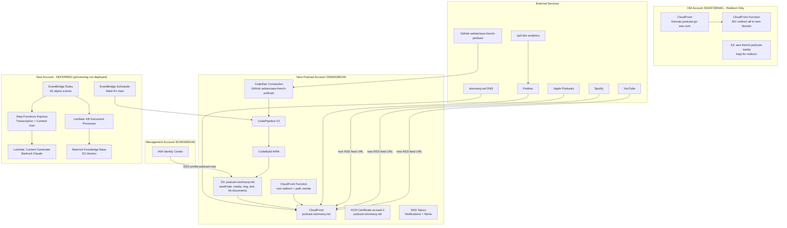

# Implementation Plan — Podcast Infrastructure Migration to Personal AWS Account

## Problem Statement

Migrate the "Podcast AWS en Français" infrastructure from AWS account 533267385481 to personal account 226945380156, with a new domain (`podcast.stormacq.net/awsfr/`), simplified architecture (no WAF), proper SSO access, and a redirect layer on the old account for SEO continuity.

## Requirements

- **Source account**: 533267385481
- **Target account**: 226945380156 (org member under management 401955065246)
- **New domain**: `podcast.stormacq.net` with `/awsfr/` path prefix
- **DNS**: `stormacq.net` fully controlled by you
- **No WAF** on target (cost-driven decision)
- **SSO access** via IDC on management account
- **301 redirect layer** on old account (CloudFront Function) for transition
- **Design goals**: simplicity, low cost, clean URLs

## Architecture



## URL Structure

| Purpose | URL |
|---------|-----|
| Website root | `https://podcast.stormacq.net/awsfr/` |
| Episode page | `https://podcast.stormacq.net/awsfr/episodes/341/` |
| RSS feed | `https://podcast.stormacq.net/awsfr/feed.xml` |
| Media files | `https://podcast.stormacq.net/awsfr/media/341.mp3` |
| Images | `https://podcast.stormacq.net/awsfr/img/341.png` |
| Root redirect | `https://podcast.stormacq.net/` → 302 → `/awsfr/` |

## S3 Bucket Layout (new)

```
podcast-stormacq-net/
└── awsfr/
    ├── site/          # website HTML output (Toucan generates here)
    ├── media/         # MP3 audio files
    ├── img/           # episode images (PNG, WebP)
    ├── text/          # transcription JSON files
    └── kb-documents/  # processed KB documents
```

## CloudFront Behaviors (new distribution)

| Path Pattern | Origin | Notes |
|-------------|--------|-------|
| `/awsfr/media/*` | S3 `awsfr/media/` | Direct pass-through |
| `/awsfr/img/*` | S3 `awsfr/img/` | Direct pass-through |
| `/awsfr/*` (default for this prefix) | S3 `awsfr/site/` | CloudFront Function rewrites: strips `/awsfr/` prefix, serves from `awsfr/site/` |
| `/*` (default) | — | CloudFront Function: 302 redirect `/` → `/awsfr/` |

## Redirect Mapping (old account CloudFront Function)

| Old Path | New URL (301) |
|----------|---------------|
| `/web/*` | `https://podcast.stormacq.net/awsfr/{*}` |
| `feed.xml` | `https://podcast.stormacq.net/awsfr/feed.xml` |
| `/media/*` | `https://podcast.stormacq.net/awsfr/media/{*}` |
| `/img/*` | `https://podcast.stormacq.net/awsfr/img/{*}` |
| `/*` (anything else) | `https://podcast.stormacq.net/awsfr/` |

---

## Task Breakdown

### Task 1: Configure AWS CLI profiles (rename old, create new)

**Objective**: Rename the existing `podcast` profile (pointing to 533267385481) to `podcast-old`, then create the new `podcast` profile via IAM Identity Center for 226945380156. This way all existing scripts and CDK commands keep using `--profile podcast` without modification.

**Implementation guidance**:

**Step 1 — Rename existing profile in `~/.aws/config`**:

```ini
# Before (current state)
[profile podcast]
# ... points to account 533267385481

# After (rename to podcast-old)
[profile podcast-old]
# ... same credentials/config, points to account 533267385481
```

Also rename in `~/.aws/credentials` if using static keys there.

**Step 2 — Create the new `podcast` profile**:

```ini
[sso-session stormacq]
sso_start_url = https://<your-idc-instance>.awsapps.com/start
sso_region = <idc-region>
sso_registration_scopes = sso:account:access

[profile podcast]
sso_session = stormacq
sso_account_id = 226945380156
region = eu-central-1
sso_role_name = AdministratorAccess
output = json
```

**Step 3 — Verify both profiles**:

```bash
# New account
aws sso login --profile podcast
aws sts get-caller-identity --profile podcast
# → account 226945380156

# Old account (for migration tasks like data sync, redirect setup)
aws sts get-caller-identity --profile podcast-old
# → account 533267385481
```

- During migration, use `--profile podcast-old` explicitly for any command that targets the old account (e.g., cross-account S3 sync, redirect CF function deployment)
- After migration is complete and old infra is decommissioned, remove `podcast-old` entirely

**Test**: `aws sts get-caller-identity --profile podcast` returns account 226945380156, `aws sts get-caller-identity --profile podcast-old` returns account 533267385481.

**Demo**: Both accounts accessible via distinct profiles, `podcast` now targets new account.

---

### Task 2: Bootstrap CDK and create the S3 bucket

**Objective**: Prepare the new account for CDK deployments and create the primary S3 bucket.

**Implementation guidance**:

Bootstrap CDK in both regions:

```bash
npx cdk bootstrap aws://226945380156/eu-central-1 --profile podcast
npx cdk bootstrap aws://226945380156/us-east-1 --profile podcast
```

- Create S3 bucket `podcast-stormacq-net` via CDK (new stack or part of the pipeline stack)
- Enable EventBridge notifications (required for processing workflows)
- Block public access (CloudFront OAC will be used)
- Optional: enable versioning on `awsfr/media/` prefix for safety
- Create the prefix structure: `awsfr/site/`, `awsfr/media/`, `awsfr/img/`, `awsfr/text/`, `awsfr/kb-documents/`

**Test**: Bucket exists, `aws s3 ls s3://podcast-stormacq-net/ --profile podcast` works.

**Demo**: S3 bucket ready to receive data.

---

### Task 3: Request and validate ACM certificate

**Objective**: Create an ACM certificate in `us-east-1` for `podcast.stormacq.net` (required for CloudFront).

**Implementation guidance**:

```bash
aws acm request-certificate \
  --domain-name "podcast.stormacq.net" \
  --validation-method DNS \
  --region us-east-1 \
  --profile podcast
```

- Add DNS validation CNAME record to your `stormacq.net` zone
- Wait for status `ISSUED` (usually 2-5 minutes)
- Note the certificate ARN for use in CDK stack

**Test**: `aws acm describe-certificate --certificate-arn <arn> --region us-east-1 --profile podcast` shows status `ISSUED`.

**Demo**: TLS certificate ready for CloudFront.

---

### Task 4: Create CodeStar Connection to GitHub

**Objective**: Establish a GitHub connection in the new account for the CI pipeline.

**Implementation guidance**:

Create connection via console (requires browser-based GitHub OAuth flow):

```bash
aws codestar-connections create-connection \
  --provider-type GitHub \
  --connection-name "github-sebsto" \
  --region eu-central-1 \
  --profile podcast
```

- Complete the handshake in the AWS Console (CodePipeline → Settings → Connections) — this requires clicking through to GitHub and authorizing
- Note the connection ARN for the CDK stack
- Update `getGithubConnectionArn()` in `cdk-stack.ts` to add a case for 226945380156

**Test**: Connection status is `AVAILABLE`.

**Demo**: GitHub connection ready for CodePipeline.

---

### Task 5: Update CDK pipeline stack for new account

**Objective**: Adapt the CDK pipeline code to deploy on the new account with new architecture.

**Implementation guidance**:

Update `cdk.ts`:
- Change account to 226945380156

Update `cdk-stack.ts`:
- Replace imported bucket with CDK-managed bucket `podcast-stormacq-net`
- Remove WAF WebACL reference entirely (cost decision)
- Update ACM certificate ARN to the new one
- Update CloudFront domain to `podcast.stormacq.net`
- Update S3 deploy action: deploy to `awsfr/site/` prefix (instead of `web/`)
- Add CloudFront Function for:
  - Request `/awsfr/*` (not media/img): rewrite URI to serve from `awsfr/site/`
  - Request `/` or empty: 302 to `/awsfr/`
- Add CloudFront cache behaviors:
  - `/awsfr/media/*` and `/awsfr/img/*`: direct to S3, long cache TTL
  - Default (`/awsfr/*`): shorter cache or cache disabled (same as current)
- Update `getGithubConnectionArn()` for new account
- **Do NOT deploy EventBridge Scheduler** (Wed+Fri pipeline trigger) — not in use currently
- Keep SNS failure notifications (update email if needed)
- Remove CloudFront logs bucket reference (or create a new logs bucket if you want analytics)

**Test**: `npx cdk synth --profile podcast` produces valid CloudFormation.

**Demo**: CDK stack synthesizes cleanly with new architecture.

---

### Task 6: ~~Update CDK processing stacks for new account~~ (DEFERRED)

**Status**: Skipped — S3 processing (transcription, content generation, knowledge base) is not in use currently. The CDK code can be updated later when re-enabling.

**When to revisit**: If/when you want to re-enable automatic transcription and content generation on episode upload.

**Notes for future**:
- Update `cdk-infrastructure.ts`: change account to 226945380156
- Update all processing stacks to reference new bucket name `podcast-stormacq-net` and new prefixes (`awsfr/media/`, `awsfr/text/`, `awsfr/kb-documents/`)
- Update vector bucket name to `french-podcast-kb-vectors-226945380156`

---

### Task 7: Update Toucan site configuration and build output

**Objective**: Update the static site generator config to produce correct URLs for the new domain.

**Implementation guidance**:

Update `toucan.yml`:

```yaml
targets:
    - name: prod
      config: toucan
      input: toucan
      url: "https://podcast.stormacq.net/awsfr/"
    - name: preview
      ...
```

Update `site.yml`:
- `french_podcast_url: https://podcast.stormacq.net`
- `medialink: https://op3.dev/e/dts.podtrac.com/redirect.mp3/podcast.stormacq.net/awsfr/media/`
- `imagelink: https://podcast.stormacq.net/awsfr/img/`
- Update `rss.owner.email` if changing from amazon.com email

Update `rss.mustache`:
- Change `xmlns:aws` namespace URL to new domain
- The `{{baseUrl}}` and `{{site.medialink}}` references will auto-resolve from `site.yml`

Update `buildspec.yaml`:
- No changes needed (it just runs npm + toucan)

Update `upload_episode.sh`:
- Change `PODCAST_BUCKET=podcast-stormacq-net`
- Update prefixes: `MEDIA_PREFIX=awsfr/media`, `IMG_PREFIX=awsfr/img`

**Test**: `make dev` locally generates site with correct URLs in `feed.xml` and HTML.

**Demo**: Site builds locally with new URLs.

---

### Task 8: Deploy pipeline stack to new account

**Objective**: Deploy the CI/CD pipeline to the new account.

**Implementation guidance**:

```bash
cd scripts/cdk-build/pipeline
npx cdk deploy --profile podcast
```

- Verify pipeline is created and GitHub connection triggers on push
- Trigger a manual pipeline run to test the full flow (build + deploy to S3)
- Verify the output lands in `s3://podcast-stormacq-net/awsfr/site/`

**Test**: Pipeline runs green, artifacts in S3, CloudFront serves the site.

**Demo**: Push to main triggers build and deploys to new infrastructure.

---

### Task 9: ~~Deploy processing stacks to new account~~ (DEFERRED)

**Status**: Skipped — S3 processing workflows (transcription, content generation, knowledge base) are not in use currently. Data is migrated (Task 10) but automated processing is not deployed.

**When to revisit**: If/when you want to re-enable automatic transcription and content generation on episode upload.

**Notes for future**:
- Create S3 vector bucket (`french-podcast-kb-vectors-226945380156`)
- Deploy processing CDK stacks
- Create Bedrock KB data source
- Verify EventBridge rules trigger on S3 uploads

---

### Task 10: Migrate historical data from old bucket to new bucket

**Objective**: Copy all media files, images, transcriptions, and knowledge base documents to the new bucket with the new prefix structure.

**Implementation guidance**:

Since the two accounts don't have cross-account access, transit the data through the local laptop (download then upload).

**Step 1 — Check total size on old bucket**:

```bash
aws s3 ls s3://aws-french-podcast-media/ --recursive --summarize \
  --profile podcast-old --region eu-central-1 | tail -2
```

Verify you have enough free disk space on the laptop before proceeding.

**Step 2 — Download from old account**:

```bash
mkdir -p /tmp/podcast-migration/{media,img,text,kb-documents}

aws s3 sync s3://aws-french-podcast-media/media/ /tmp/podcast-migration/media/ \
  --profile podcast-old --region eu-central-1

aws s3 sync s3://aws-french-podcast-media/img/ /tmp/podcast-migration/img/ \
  --profile podcast-old --region eu-central-1

aws s3 sync s3://aws-french-podcast-media/text/ /tmp/podcast-migration/text/ \
  --profile podcast-old --region eu-central-1

aws s3 sync s3://aws-french-podcast-media/kb-documents/ /tmp/podcast-migration/kb-documents/ \
  --profile podcast-old --region eu-central-1
```

**Step 3 — Upload to new account**:

```bash
aws s3 sync /tmp/podcast-migration/media/ s3://podcast-stormacq-net/awsfr/media/ \
  --profile podcast --region eu-central-1

aws s3 sync /tmp/podcast-migration/img/ s3://podcast-stormacq-net/awsfr/img/ \
  --profile podcast --region eu-central-1

aws s3 sync /tmp/podcast-migration/text/ s3://podcast-stormacq-net/awsfr/text/ \
  --profile podcast --region eu-central-1

aws s3 sync /tmp/podcast-migration/kb-documents/ s3://podcast-stormacq-net/awsfr/kb-documents/ \
  --profile podcast --region eu-central-1
```

**Step 4 — Verify counts match**:

```bash
# Compare file counts
echo "Old media: $(aws s3 ls s3://aws-french-podcast-media/media/ --profile podcast-old --region eu-central-1 | wc -l)"
echo "New media: $(aws s3 ls s3://podcast-stormacq-net/awsfr/media/ --profile podcast --region eu-central-1 | wc -l)"
```

**Step 5 — Clean up local copy**:

```bash
rm -rf /tmp/podcast-migration
```

> **Note**: With ~360 episodes the media files could be significant. The sync is resumable — if interrupted, re-run the same commands and only missing files will transfer.

**Test**: File counts match between old and new buckets for each prefix.

**Demo**: All historical content accessible on new infrastructure.

---

### Task 11: Configure DNS for podcast.stormacq.net

**Objective**: Point `podcast.stormacq.net` to the new CloudFront distribution.

**Implementation guidance**:

- Get the CloudFront distribution domain name from the CDK output
- Add DNS records in your `stormacq.net` zone:

```
podcast.stormacq.net  CNAME  <distribution-id>.cloudfront.net
```

Or if using Route 53 for `stormacq.net`:

```
podcast.stormacq.net  A  ALIAS <cloudfront-distribution>
```

- Verify HTTPS works: `curl -I https://podcast.stormacq.net/awsfr/`

**Test**: `https://podcast.stormacq.net/awsfr/` loads the podcast website, `https://podcast.stormacq.net/awsfr/feed.xml` returns valid RSS.

**Demo**: New domain is live and serving content.

---

### Task 12: Deploy redirect CloudFront Function on old account

**Objective**: Replace the old CloudFront distribution's behavior with a 301 redirect function pointing to the new domain.

**Implementation guidance**:

Create a CloudFront Function on the old account (533267385481, use `--profile podcast-old`):

```javascript
function handler(event) {
  var request = event.request;
  var uri = request.uri;
  var newHost = 'podcast.stormacq.net';
  var newPath;

  if (uri.startsWith('/web/')) {
    newPath = '/awsfr/' + uri.substring(5);
  } else if (uri.startsWith('/media/')) {
    newPath = '/awsfr' + uri;
  } else if (uri.startsWith('/img/')) {
    newPath = '/awsfr' + uri;
  } else {
    newPath = '/awsfr/';
  }

  return {
    statusCode: 301,
    statusDescription: 'Moved Permanently',
    headers: {
      'location': { value: 'https://' + newHost + newPath },
      'cache-control': { value: 'max-age=86400' }
    }
  };
}
```

- Associate the function with the existing CloudFront distribution's default behavior (viewer request)
- Remove the S3 origin (or keep it — it won't be reached since the function returns before origin fetch)
- Optionally: remove the WAF association from the old distribution too (saves cost immediately)
- Keep the old ACM certificate and CloudFront alive as long as `francais.podcast.go-aws.com` DNS points to it

**Test**: `curl -I https://francais.podcast.go-aws.com/web/episodes/341/` returns 301 to `https://podcast.stormacq.net/awsfr/episodes/341/`.

**Demo**: All old URLs redirect to new domain.

---

### Task 13: Update op3.dev tracking

**Objective**: Update the op3.dev show configuration so download analytics continue tracking correctly after the domain change.

**Implementation guidance**:

- Show dashboard: https://op3.dev/show/d8347e02-cf46-566b-924b-468b4d848aee
- Log in to op3.dev and navigate to show settings
- Update the **feed URL** from `https://francais.podcast.go-aws.com/web/feed.xml` to `https://podcast.stormacq.net/awsfr/feed.xml`
- Verify op3 recognizes the new media URL pattern: `https://op3.dev/e/dts.podtrac.com/redirect.mp3/podcast.stormacq.net/awsfr/media/{N}.mp3`
- The op3 prefix in `site.yml` already encodes the redirect chain — once the domain is updated, new episodes will track automatically
- Historical data remains tied to the show ID (`d8347e02-cf46-566b-924b-468b4d848aee`), so no data loss
- After updating, trigger a feed refresh on op3 and verify at least one episode resolves through the full chain

**Test**: Open `https://op3.dev/e/dts.podtrac.com/redirect.mp3/podcast.stormacq.net/awsfr/media/341.mp3` in a browser — it should redirect through Podtrac and ultimately serve the MP3. Confirm the download appears in the op3 dashboard.

**Demo**: op3.dev analytics dashboard shows downloads from the new domain.

---

### Task 14: Update Podtrac configuration

**Objective**: Update Podtrac publisher settings to recognize the new podcast domain for download measurement.

**Implementation guidance**:

- Log in to Podtrac Publisher portal (https://publisher.podtrac.com/)
- Navigate to your podcast show settings
- Update the **authorized domain** (or redirect target) from `francais.podcast.go-aws.com` to `podcast.stormacq.net`
- Podtrac works as a redirect pass-through: `dts.podtrac.com/redirect.mp3/podcast.stormacq.net/awsfr/media/{N}.mp3` → it logs the download then 302s to the final MP3 URL
- If Podtrac requires a feed URL, update it to `https://podcast.stormacq.net/awsfr/feed.xml`
- Verify the redirect chain works: op3 → Podtrac → CloudFront → S3

**Test**: `curl -vL "https://dts.podtrac.com/redirect.mp3/podcast.stormacq.net/awsfr/media/341.mp3"` should follow redirects and return the MP3 (HTTP 200 from CloudFront). Confirm the measurement shows up in the Podtrac dashboard.

**Demo**: Podtrac measurement active on the new domain, download stats uninterrupted.

---

### Task 15: Update podcast platforms (Apple, Spotify, YouTube)

**Objective**: Update the RSS feed URL in all podcast distribution platforms.

**Implementation guidance**:

- **Apple Podcasts Connect** (podcasters.apple.com): Update feed URL to `https://podcast.stormacq.net/awsfr/feed.xml`
- **Spotify for Podcasters** (podcasters.spotify.com): Update feed URL
- **YouTube Music/Podcasts**: Update feed URL (via YouTube Studio)
- **Amazon Music**: Update feed URL
- **Deezer**: Update feed URL

> **Note**: Most platforms will also follow the 301 redirect from the old feed URL naturally, but explicitly updating ensures no dependency on the old infrastructure.

Also update the short links (`sebs.to`) if you control those:
- `sebs.to/paef_rss` → new feed URL

**Test**: Each platform picks up new episodes from the new feed URL.

**Demo**: All podcast platforms pulling from new infrastructure.

---

### Task 16: Update project documentation and steering files

**Objective**: Update all references in code, docs, and Kiro steering files to reflect the new account, bucket, domain, and profile.

**Implementation guidance**:

- `aws-cli-usage.md`: Update account to 226945380156, bucket to `podcast-stormacq-net`
- `episode-structure.md`: Update bucket name, S3 paths (add `awsfr/` prefix), domain references
- `social-media-preparation.md`: Update episode URLs to new domain
- `scripts/podcast-search-mcp-server/`: Update `RSS_FEED_URL` default, README examples
- `scripts/bulk-knowledge-base-ingestion/`: Update bucket name and prefix constants
- Remove references to old account 533267385481 where no longer relevant
- Document the redirect layer as temporary infrastructure on old account

**Test**: Grep for old account ID, old bucket name, old domain — no stale references in active code.

**Demo**: All documentation is consistent with new setup.

---

### Task 17: Verify end-to-end and clean up

**Objective**: Full end-to-end verification and cleanup of temporary migration artifacts.

**Implementation guidance**:

Verify checklist:
- [ ] Push to GitHub → pipeline builds → deploys to new S3 → CloudFront serves correctly
- [ ] New episode upload (`upload_episode.sh 999`) → files land in correct S3 prefixes
- [ ] RSS feed validates (use https://podba.se/validate/ or Apple's feed validator)
- [ ] Old URLs 301 to new URLs
- [ ] op3/podtrac analytics tracking
- [ ] All podcast platforms show latest episode
- [ ] ~~Processing pipeline~~ (deferred — not deployed)

Cleanup:
- Remove temporary cross-account bucket policy on old account (`--profile podcast-old`)
- Remove old CDK stacks from old account (optional — can keep for redirect) or simplify to just CloudFront + Function
- Once old infra is decommissioned, remove `podcast-old` profile from `~/.aws/config`
- Consider: set a calendar reminder to tear down old redirect infrastructure in 6 months

**Test**: Publish a new episode end-to-end through the complete workflow.

**Demo**: Complete podcast production workflow operates on new infrastructure.

---

## Things you might have forgotten (addressed in this plan)

- ✅ **op3.dev / Podtrac analytics** — media URLs route through these services, domain change requires update
- ✅ **ACM certificate** — new cert needed for new domain
- ✅ **RSS feed namespace** — the `xmlns:aws` in the RSS template references old domain
- ✅ **sebs.to short links** — used in social media posts, may point to old URLs
- ✅ **Knowledge Base re-ingestion** — after data migration, need to re-index
- ✅ **CloudFront logs bucket** — decide if you want analytics on new account
- ✅ **Email notifications** — SNS subscriptions need confirming on new account (new topic = new subscription confirmation email)
- ✅ **Scheduled pipeline triggers** — Wednesday + Friday schedule needs deploying
- ✅ **upload_episode.sh** — references old bucket name and paths
- ✅ **MCP search server** — references old RSS URL and account
