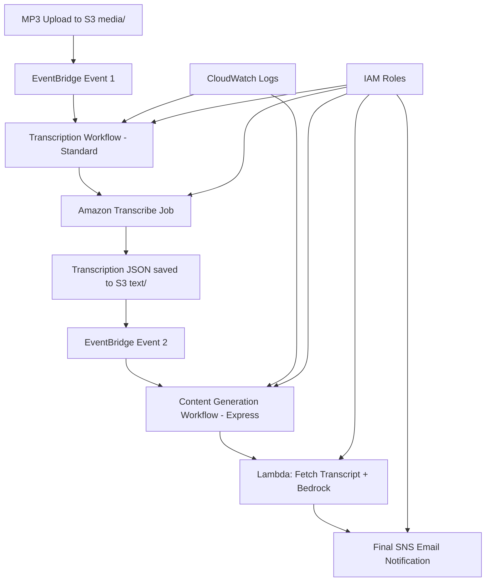

# Design Document

## Overview

The Podcast Episode Processor is a serverless, event-driven system that automatically processes podcast episodes uploaded to Amazon S3. The system uses a **two-workflow architecture** with AWS Step Functions to optimize for performance, cost, and scalability. The architecture prioritizes simplicity, maintainability, and cost-effectiveness by using AWS managed services with direct integrations and eliminating polling/waiting patterns.

## Architecture

The system follows a **dual-workflow, event-driven architecture** that splits processing into two independent workflows:

### Workflow 1: Transcription Pipeline (Standard Step Functions)
1. **Trigger**: MP3 file upload to S3 `media/` folder generates EventBridge event
2. **Orchestration**: EventBridge rule triggers Transcription Step Functions state machine
3. **Transcription**: Step Functions calls Amazon Transcribe to start transcription job
4. **Notification**: Sends "transcription started" notification via SNS
5. **Completion**: Transcribe automatically saves results to S3 `text/` folder

### Workflow 2: Content Generation Pipeline (Express Step Functions)
1. **Trigger**: Transcription JSON file creation in S3 `text/` folder generates EventBridge event
2. **Orchestration**: EventBridge rule triggers Content Generation Step Functions state machine
3. **Content Generation**: Step Functions calls Lambda function that fetches transcript from S3 and invokes Amazon Bedrock
4. **Notification**: Sends final email with generated content via SNS



### Architecture Benefits
- **Cost Optimization**: Express workflows are ~10x cheaper for content generation
- **Performance**: No polling/waiting - pure event-driven processing
- **Scalability**: Handles large transcription files (>256KB) by processing them in Lambda
- **Reliability**: Standard workflow for critical transcription, Express for fast content generation
- **Maintainability**: Clear separation of concerns between transcription and content generation

## Components and Interfaces

### S3 Bucket
- **Existing Bucket**: `aws-french-podcast-media` (account: 533267385481, region: eu-central-1)
- **Source Path**: `media/` - monitors for MP3 file uploads
- **Transcription Output**: `text/` - stores transcription results
- **Configuration**: EventBridge notifications enabled for object creation events in `media/` prefix
- **Security**: Server-side encryption enabled, public access blocked

### IAM Permissions (Least Privilege)
- **EventBridge Service Role**:
  - `s3:GetObject` on `aws-french-podcast-media/media/*`
  - `events:PutEvents` for triggering Step Functions
- **Transcribe Service Role**:
  - `s3:GetObject` on `aws-french-podcast-media/media/*`
  - `s3:PutObject` on `aws-french-podcast-media/text/*`
- **Step Functions Execution Role**:
  - `transcribe:StartTranscriptionJob`, `transcribe:GetTranscriptionJob`
  - `sns:Publish` for email notifications
  - `lambda:InvokeFunction` for content generation
  - `logs:CreateLogGroup`, `logs:CreateLogStream`, `logs:PutLogEvents`
- **Lambda Execution Role** (Content Generator):
  - `s3:GetObject` on `aws-french-podcast-media/text/*`
  - `bedrock:InvokeModel` for AI content generation
  - `logs:CreateLogGroup`, `logs:CreateLogStream`, `logs:PutLogEvents`

### EventBridge Rules
- **Rule 1 - MP3 Upload Trigger**:
  - **Purpose**: Captures MP3 file creation events and triggers transcription workflow
  - **Event Pattern**: Matches MP3 file uploads to `aws-french-podcast-media/media/` prefix
  - **Target**: Transcription Step Functions state machine
  - **Region**: eu-central-1

- **Rule 2 - Transcription Completion Trigger**:
  - **Purpose**: Captures transcription JSON file creation and triggers content generation workflow
  - **Event Pattern**: Matches JSON file creation in `aws-french-podcast-media/text/` prefix
  - **Target**: Content Generation Step Functions state machine
  - **Region**: eu-central-1

### Step Functions State Machines
- **Transcription Workflow**:
  - **Type**: Standard Workflow (for reliability and auditability)
  - **Purpose**: Handle MP3 transcription with Amazon Transcribe
  - **Timeout**: 30 minutes (for large audio files)
  - **Logging**: Full logging with execution data for debugging

- **Content Generation Workflow**:
  - **Type**: Express Workflow (for cost optimization and speed)
  - **Purpose**: Generate content using Amazon Bedrock
  - **Timeout**: 5 minutes (fast AI processing)
  - **Logging**: Error-only logging to minimize costs

- **Integration Pattern**: Both use AWS SDK integrations for direct service calls
- **Error Handling**: Implements retry logic and error notifications
- **Monitoring**: CloudWatch Logs integration and custom alarms

### Amazon Transcribe Integration
- **Service**: Amazon Transcribe (batch transcription jobs)
- **Input**: S3 URI of uploaded MP3 file
- **Output**: Transcription job results stored in S3
- **Configuration**: French language support, automatic language detection as fallback

### Lambda Function (Content Generator)
- **Purpose**: Fetch transcript content from S3 and generate content using Amazon Bedrock
- **Runtime**: Node.js 18.x
- **Memory**: 512MB (handles large transcript processing)
- **Timeout**: 5 minutes (allows for Bedrock processing time)
- **Input**: S3 bucket and key for transcript file
- **Output**: Generated content (titles, description, social media posts)
- **Integration**: Called by Step Functions using `arn:aws:states:::lambda:invoke`
- **Architecture**: Eliminates Step Functions 256KB limit by processing large files in Lambda

### Amazon Bedrock Integration
- **Model**: Anthropic Claude 3.5 Sonnet (`anthropic.claude-3-5-sonnet-20240620-v1:0`)
- **Input Method**: Direct transcript text in prompt (processed by Lambda function)
- **Input**: Full transcript text and structured French prompt
- **Output**: JSON-formatted content with titles, descriptions, and social media posts
- **Prompt**: French podcast producer prompt with embedded transcript content
- **Integration**: Called from Lambda function using AWS SDK
- **Architecture**: Lambda fetches transcript from S3 and includes full text in Bedrock request

### Amazon SNS Integration
- **Topic**: Email notification topic
- **Subscriber**: Single email address (stormacq@amazon.com)
- **Message Format**: Structured email with all generated content

## Data Models

### Transcription Workflow State Data
```json
{
  "executionId": "string",
  "inputBucket": "string",
  "inputKey": "string",
  "episodeNumber": "string",
  "transcriptionJob": {
    "TranscriptionJob": {
      "TranscriptionJobName": "string",
      "TranscriptionJobStatus": "IN_PROGRESS|COMPLETED|FAILED",
      "CreationTime": "timestamp",
      "StartTime": "timestamp"
    }
  }
}
```

### Content Generation Workflow State Data
```json
{
  "executionId": "string",
  "inputBucket": "string",
  "transcriptionKey": "string",
  "originalMp3Key": "string",
  "episodeNumber": "string",
  "contentResult": {
    "Payload": {
      "generatedContent": "string",
      "transcriptKey": "string",
      "bucket": "string",
      "success": true
    }
  },
  "generatedContentText": "string",
  "parsedContent": {
    "titles": ["string"],
    "description": "string",
    "social_media": {
      "linkedin": "string",
      "twitter": "string"
    }
  }
}
```

### Transcribe Job Configuration
```json
{
  "TranscriptionJobName": "podcast-episode-{episode-number}-{timestamp}",
  "LanguageCode": "fr-FR",
  "MediaFormat": "mp3",
  "Media": {
    "MediaFileUri": "s3://aws-french-podcast-media/media/{filename}.mp3"
  },
  "OutputBucketName": "aws-french-podcast-media",
  "OutputKey": "text/{episode-number}-transcribe.json",
  "Settings": {
    "ShowSpeakerLabels": false,
    "MaxSpeakerLabels": 1
  }
}
```

### File Naming Convention
- **Source**: `media/{episode-number}.mp3`
- **Transcription Output**: `text/transcription-output.json` (Amazon Transcribe standard output)
- **Event Flow**: 
  1. MP3 upload to `media/` → triggers Transcription Workflow
  2. JSON creation in `text/` → triggers Content Generation Workflow

### Lambda Function Structure
```json
{
  "FunctionName": "podcast-content-generator",
  "Payload": {
    "bucket": "aws-french-podcast-media",
    "key": "text/336-transcribe.json"
  }
}
```

### Lambda Function Response
```json
{
  "generatedContent": "{\"titles\":[...],\"description\":\"...\",\"social_media\":{...}}",
  "transcriptKey": "text/336-transcribe.json",
  "bucket": "aws-french-podcast-media",
  "success": true
}
```

**Architecture Benefits of Lambda-Based Approach:**
- **Large File Handling**: Lambda can process files of any size (up to 10GB with streaming)
- **Cost Efficiency**: No data transfer through Step Functions state
- **Security**: Direct IAM-based S3 access without time-limited URLs
- **Performance**: Single Lambda call handles both S3 fetch and Bedrock invocation
- **Scalability**: Handles transcript files of any size (tested with 1.5MB files)
- **Reliability**: Eliminates presigned URL expiration issues

## Correctness Properties

*A property is a characteristic or behavior that should hold true across all valid executions of a system—essentially, a formal statement about what the system should do. Properties serve as the bridge between human-readable specifications and machine-verifiable correctness guarantees.*

Based on the prework analysis, I'll consolidate related properties to eliminate redundancy:

**Property Reflection:**
- Properties 1.1 and 1.2 can be combined into a single file validation property
- Properties 2.3 and 3.5 both test retry logic and can be generalized into a single retry property
- Properties 4.1, 4.2, and 4.3 all relate to email content and can be combined
- Properties 5.3, 5.4, and 5.5 all relate to workflow orchestration and can be consolidated

Property 1: File validation and workflow triggering
*For any* file uploaded to the S3 bucket, the system should only start processing workflows for valid MP3 files and reject all other file types gracefully
**Validates: Requirements 1.1, 1.2, 1.3**

Property 2: Unique execution tracking
*For any* workflow execution, the system should generate a unique processing identifier that can be used for tracking throughout the pipeline
**Validates: Requirements 1.4**

Property 3: Transcription processing
*For any* valid MP3 file, the transcription service should generate a readable text transcript and store it in the expected structured format
**Validates: Requirements 2.1, 2.2, 2.4**

Property 4: Retry behavior for failures
*For any* step that encounters transient failures, the system should retry the operation the specified number of times before proceeding with error handling
**Validates: Requirements 2.3, 3.5**

Property 5: Content generation completeness
*For any* transcript, the content generator should produce all required elements: 2-3 titles, episode description, LinkedIn post, and Twitter post (≤200 characters) with proper structure
**Validates: Requirements 3.1, 3.2, 3.3, 3.4**

Property 6: Email notification completeness
*For any* completed or failed workflow, the notification service should send an appropriately formatted email containing all relevant content or error details to the specified address
**Validates: Requirements 4.1, 4.2, 4.3, 4.4**

Property 7: Workflow orchestration reliability
*For any* workflow execution, the Step Functions orchestrator should maintain state between steps, handle retries for transient failures, and execute cleanup procedures when errors occur
**Validates: Requirements 5.3, 5.4, 5.5**

Property 8: Logging quality
*For any* workflow execution, the system should generate logs that contain sufficient information for troubleshooting without being excessively verbose
**Validates: Requirements 6.3**

## Error Handling

### Transcription Errors
- **Retry Strategy**: Exponential backoff with 3 maximum attempts
- **Failure Actions**: Log error details, notify via email, terminate workflow
- **Common Scenarios**: Invalid audio format, corrupted files, service limits

### Content Generation Errors
- **Retry Strategy**: Linear backoff with 2 maximum attempts
- **Failure Actions**: Log error details, send transcript-only email, mark as partial success
- **Common Scenarios**: Model unavailability, prompt token limits, content filtering

### Notification Errors
- **Retry Strategy**: Exponential backoff with 3 maximum attempts
- **Failure Actions**: Log to CloudWatch, attempt alternative notification methods
- **Common Scenarios**: SNS service limits, invalid email configuration

### Infrastructure Errors
- **Monitoring**: CloudWatch alarms for Step Functions failures
- **Alerting**: SNS notifications for critical system failures
- **Recovery**: Automatic retry for transient AWS service issues

## Testing Strategy

### Dual Testing Approach

The system will implement both unit testing and property-based testing to ensure comprehensive coverage:

**Unit Testing:**
- Test specific examples of valid MP3 file processing
- Test error scenarios with invalid file formats
- Test email formatting with sample content
- Test Step Functions state transitions with mock data
- Integration tests for AWS service interactions

**Property-Based Testing:**
- Use **fast-check** (JavaScript/TypeScript) for property-based testing
- Configure each property test to run a minimum of 100 iterations
- Each property-based test must include a comment referencing the design document property
- Tag format: `**Feature: podcast-episode-processor, Property {number}: {property_text}**`

**Testing Framework:**
- **Unit Tests**: Jest for JavaScript/TypeScript testing
- **Property Tests**: fast-check library for property-based testing
- **Integration Tests**: AWS SDK mocking with aws-sdk-mock
- **Infrastructure Tests**: CDK unit tests for infrastructure validation

### Infrastructure as Code
- **Framework**: AWS CDK (TypeScript)
- **Deployment Target**: Account 533267385481, Region eu-central-1
- **AWS Profile**: `podcast` (use `--profile podcast` for CLI commands)
- **Existing Resources**: Leverages existing S3 bucket `aws-french-podcast-media`
- **New Resources**: Step Functions state machine, EventBridge rules, IAM roles, SNS topic

**Test Coverage Requirements:**
- Each correctness property must be implemented by a single property-based test
- Unit tests verify specific examples and edge cases
- Property tests verify universal behaviors across all valid inputs
- Integration tests validate AWS service interactions