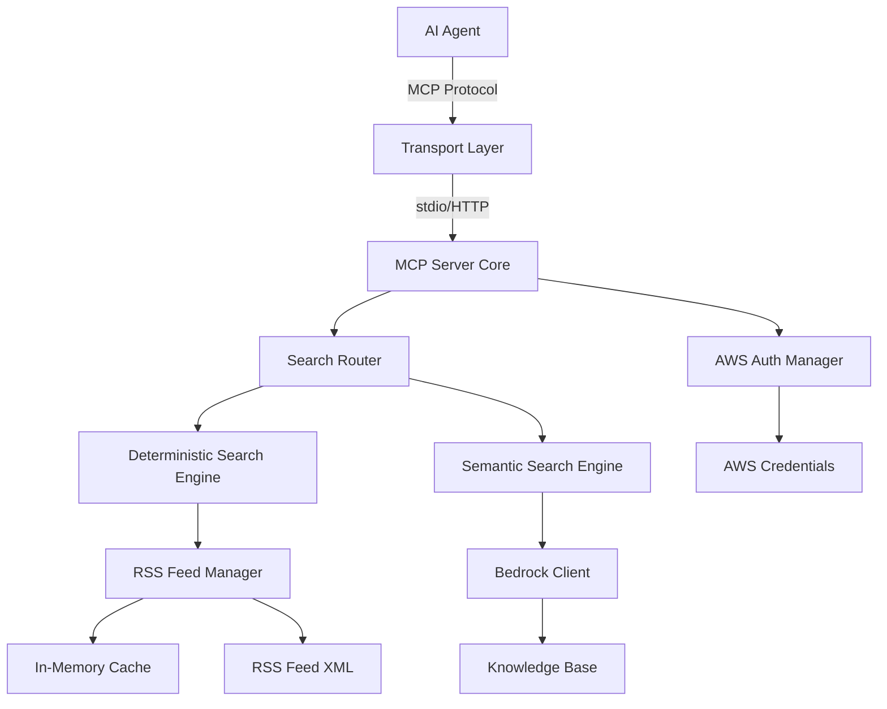

# Design Document: Podcast Search MCP Server

## Overview

The Podcast Search MCP Server is a Model Context Protocol server built with the Strands Agents framework that provides intelligent search capabilities for the AWS French Podcast. The server exposes five search tools to AI agents, enabling both deterministic searches (via RSS feed) and semantic searches (via Amazon Bedrock Knowledge Base).

The server is designed with a clear separation between transport and business logic, allowing future migration from stdio (local execution) to HTTP (AgentCore deployment) without rewriting core functionality.

### Key Design Principles

1. **Transport Agnostic**: Core search logic is independent of communication protocol
2. **Dual Search Strategy**: Deterministic searches for structured queries, semantic search for natural language
3. **Efficient Caching**: RSS feed cached in memory to minimize network calls
4. **Cloud-Ready**: Architecture supports both local and AgentCore deployment
5. **Extensible**: Easy to add new search capabilities or data sources

## Architecture

### High-Level Architecture



### Component Layers

1. **Transport Layer**: Handles stdio or HTTP communication (MCP protocol)
2. **Server Core**: FastMCP server with tool registration and lifecycle management
3. **Search Router**: Analyzes queries and routes to appropriate search engine
4. **Search Engines**: Deterministic (RSS) and Semantic (Bedrock) implementations
5. **Data Managers**: RSS feed caching and AWS credential management

## Code Organization

### Directory Structure

The codebase is organized into a `src/` directory with modules grouped by functional scope. Each module is kept under 300 lines of code for maintainability.

```
podcast-search-mcp-server/
├── src/
│   ├── __init__.py
│   ├── server.py              # Main entry point, FastMCP server initialization
│   ├── config.py              # Configuration management
│   ├── models/
│   │   ├── __init__.py
│   │   ├── episode.py         # Episode, Guest, Link data models
│   │   └── search_result.py   # SearchResult, SemanticResult models
│   ├── rss/
│   │   ├── __init__.py
│   │   ├── feed_manager.py    # RSS feed fetching and caching
│   │   └── parser.py          # RSS XML parsing logic
│   ├── search/
│   │   ├── __init__.py
│   │   ├── router.py          # Query routing and pattern detection
│   │   ├── deterministic.py   # ID, date, guest search implementations
│   │   └── semantic.py        # Bedrock semantic search
│   ├── aws/
│   │   ├── __init__.py
│   │   └── client_manager.py  # AWS credential and client management
│   ├── tools/
│   │   ├── __init__.py
│   │   ├── search_episodes.py      # Combined search tool
│   │   ├── get_episode_by_id.py    # Episode ID search tool
│   │   ├── search_by_date.py       # Date range search tool
│   │   ├── search_by_guest.py      # Guest search tool
│   │   └── semantic_search.py      # Semantic search tool
│   └── utils/
│       ├── __init__.py
│       ├── logging.py         # Logging configuration
│       └── validation.py      # Input validation utilities
├── tests/
│   ├── __init__.py
│   ├── test_*.py              # Property-based and unit tests
│   └── ...
├── podcast_search_server.py   # Entry point script (imports from src/)
├── requirements.txt
├── README.md
├── .env.example
└── .gitignore
```

### Module Responsibilities

**src/server.py** (< 150 lines):
- Initialize FastMCP server
- Register all tools
- Handle server lifecycle
- Load configuration

**src/config.py** (< 100 lines):
- ServerConfig dataclass
- Environment variable loading
- Configuration validation

**src/models/episode.py** (< 150 lines):
- Episode dataclass
- Guest dataclass
- Link dataclass
- Serialization methods

**src/models/search_result.py** (< 100 lines):
- SearchResult dataclass
- SemanticResult dataclass
- Response formatting

**src/rss/feed_manager.py** (< 200 lines):
- RSS feed fetching with retry logic
- In-memory caching with TTL
- Cache refresh logic
- Thread-safe access

**src/rss/parser.py** (< 200 lines):
- XML parsing with feedparser
- Episode metadata extraction
- Guest and link parsing
- Error handling

**src/search/router.py** (< 150 lines):
- Query pattern detection
- Search type routing
- Priority logic

**src/search/deterministic.py** (< 200 lines):
- Episode ID search
- Date range search
- Guest name search
- Result sorting

**src/search/semantic.py** (< 150 lines):
- Bedrock Knowledge Base queries
- Result enrichment with RSS data
- Relevance score handling
- Result caching

**src/aws/client_manager.py** (< 150 lines):
- AWS credential loading
- Boto3 client initialization
- Credential validation
- Profile vs IAM role handling

**src/tools/*.py** (< 100 lines each):
- Individual tool implementations
- Parameter validation
- Response formatting
- Error handling

**src/utils/logging.py** (< 100 lines):
- Logging configuration
- JSON log formatting
- CloudWatch compatibility

**src/utils/validation.py** (< 100 lines):
- Input validation functions
- Date format validation
- Episode ID validation
- Error message generation

### Import Strategy

All modules use relative imports within the `src/` package:

```python
# In src/server.py
from .config import ServerConfig
from .rss.feed_manager import RSSFeedManager
from .aws.client_manager import AWSClientManager
from .search.router import SearchRouter
from .tools import register_all_tools

# In src/search/router.py
from ..models.episode import Episode
from ..models.search_result import SearchResult
from .deterministic import DeterministicSearchEngine
from .semantic import SemanticSearchEngine
```

The main entry point (`podcast_search_server.py`) imports from the `src` package:

```python
# In podcast_search_server.py
from src.server import create_server

if __name__ == "__main__":
    server = create_server()
    server.run()
```

### Module Size Guidelines

- **Maximum 300 lines per module**: If a module exceeds this, split it
- **Single responsibility**: Each module has one clear purpose
- **Minimal dependencies**: Reduce coupling between modules
- **Clear interfaces**: Well-defined public APIs for each module

### Benefits of This Organization

1. **Maintainability**: Small files are easier to understand and modify
2. **Testability**: Each module can be tested independently
3. **Reusability**: Modules can be reused in different contexts
4. **Scalability**: Easy to add new search types or tools
5. **Clarity**: Clear separation of concerns
6. **Collaboration**: Multiple developers can work on different modules

## Components and Interfaces

### 1. MCP Server Core

**Responsibility**: Initialize FastMCP server, register tools, manage lifecycle

**Implementation**:
```python
from fastmcp import FastMCP, Context
from dataclasses import dataclass
from typing import Optional

@dataclass
class ServerConfig:
    aws_profile: Optional[str] = None  # AWS profile name for credentials
    aws_region: str = "eu-central-1"  # AWS region
    rss_feed_url: str = "https://francais.podcast.go-aws.com/web/feed.xml"
    cache_ttl_seconds: int = 3600  # RSS cache TTL (1 hour)
    bedrock_kb_id: str = ""  # Bedrock Knowledge Base ID
    max_semantic_results: int = 10  # Max results for semantic search

# Create FastMCP server instance
mcp = FastMCP("Podcast Search")

# Initialize components (will be done at module level)
config = ServerConfig()  # Load from environment or parameters
rss_manager = RSSFeedManager(config.rss_feed_url, config.cache_ttl_seconds)
aws_client = AWSClientManager(config.aws_profile, config.aws_region)
semantic_engine = SemanticSearchEngine(aws_client, config.bedrock_kb_id, config.max_semantic_results)
search_router = SearchRouter(rss_manager, semantic_engine)
```

**Server Startup**:
```python
if __name__ == "__main__":
    # FastMCP automatically handles transport selection
    # Default is stdio, can be configured for HTTP
    mcp.run()
```

### 2. Search Router

**Responsibility**: Analyze queries and route to appropriate search backend

**Interface**:
```python
class SearchRouter:
    def route_query(self, query: str, search_type: Optional[str] = None) -> SearchResult:
        """
        Route query to appropriate search engine.
        
        Args:
            query: User's search query
            search_type: Optional hint about search type
            
        Returns:
            SearchResult from appropriate engine
        """
        
    def _detect_query_type(self, query: str) -> QueryType:
        """Detect query type from patterns"""
```

**Query Type Detection**:
```python
class QueryType(Enum):
    EPISODE_ID = "episode_id"      # Pattern: "episode 341", "#341"
    DATE_RANGE = "date_range"      # Pattern: "2024-01-01 to 2024-12-31"
    GUEST_NAME = "guest_name"      # Pattern: "with [name]", "featuring [name]"
    SEMANTIC = "semantic"          # Default: natural language
```

### 3. RSS Feed Manager

**Responsibility**: Fetch, parse, cache, and search RSS feed data

**Interface**:
```python
class RSSFeedManager:
    def __init__(self, feed_url: str, cache_ttl: int):
        """Initialize with feed URL and cache TTL"""
        
    async def fetch_and_parse(self) -> List[Episode]:
        """Fetch RSS feed and parse into Episode objects"""
        
    def get_cached_episodes(self) -> List[Episode]:
        """Get episodes from cache, refresh if stale"""
        
    def search_by_id(self, episode_id: int) -> Optional[Episode]:
        """Find episode by ID"""
        
    def search_by_date_range(self, start_date: date, end_date: date) -> List[Episode]:
        """Find episodes within date range"""
        
    def search_by_guest(self, guest_name: str) -> List[Episode]:
        """Find episodes featuring guest (case-insensitive partial match)"""
```

**Episode Data Model**:
```python
@dataclass
class Episode:
    id: int
    title: str
    description: str
    publication_date: datetime
    duration: str  # Format: "HH:MM:SS"
    url: str
    file_size: int  # bytes
    guests: List[Guest]
    links: List[Link]
    
@dataclass
class Guest:
    name: str
    title: Optional[str]
    linkedin_url: Optional[str]
    
@dataclass
class Link:
    text: str
    url: str
```

**Caching Strategy**:
- In-memory cache with timestamp
- Automatic refresh when cache age > TTL
- Exponential backoff on fetch failures (3 retries)
- Thread-safe access for concurrent requests

### 4. Semantic Search Engine

**Responsibility**: Query Bedrock Knowledge Base for semantic search

**Interface**:
```python
class SemanticSearchEngine:
    def __init__(self, aws_client: AWSClientManager, kb_id: str, max_results: int):
        """Initialize with AWS client and KB configuration"""
        
    async def search(self, query: str) -> List[SemanticResult]:
        """
        Perform semantic search using Bedrock Knowledge Base.
        
        Args:
            query: Natural language search query
            
        Returns:
            List of results with relevance scores
        """
```

**Semantic Result Model**:
```python
@dataclass
class SemanticResult:
    episode_id: int
    title: str
    excerpt: str  # Relevant text snippet
    relevance_score: float  # 0.0 to 1.0
    metadata: Dict[str, Any]  # Additional metadata from KB
```

**Bedrock Integration**:
- Use `boto3` client for Bedrock Agent Runtime
- Call `retrieve` API on Knowledge Base
- Extract episode IDs from results
- Enrich with RSS feed metadata
- Cache results for 5 minutes (same query)

### 5. AWS Client Manager

**Responsibility**: Manage AWS credentials and client initialization

**Interface**:
```python
class AWSClientManager:
    def __init__(self, profile: Optional[str], region: str):
        """Initialize with AWS profile and region"""
        
    def get_bedrock_client(self):
        """Get boto3 client for Bedrock Agent Runtime"""
        
    def verify_credentials(self) -> bool:
        """Verify AWS credentials are valid"""
```

**Credential Handling**:
- **Local (stdio)**: Use AWS profile from configuration
- **AgentCore (HTTP)**: Use IAM role from execution environment
- **Fallback**: Default credential chain if no profile specified
- **Validation**: Call STS GetCallerIdentity on initialization

### 6. Tool Implementations

Each tool is registered with FastMCP using the `@mcp.tool()` decorator:

**Tool 1: search_episodes**
```python
@mcp.tool()
async def search_episodes(
    query: str,
    search_type: Optional[str] = None
) -> str:
    """
    Search podcast episodes using various criteria.
    
    Args:
        query: Search query (episode ID, date range, guest name, or natural language)
        search_type: Optional hint ("id", "date", "guest", "semantic")
        
    Returns:
        JSON string with search results
    """
    result = await search_router.route_query(query, search_type)
    return json.dumps(result.to_dict())
```

**Tool 2: get_episode_by_id**
```python
@mcp.tool()
async def get_episode_by_id(episode_id: int) -> str:
    """
    Get detailed information about a specific episode by ID.
    
    Args:
        episode_id: Episode number (e.g., 341)
        
    Returns:
        JSON string with episode details or error message
    """
    episode = rss_manager.search_by_id(episode_id)
    if episode:
        return json.dumps({"status": "success", "count": 1, "results": [episode.to_dict()]})
    else:
        return json.dumps({
            "status": "error",
            "error_type": "NotFoundError",
            "message": f"Episode {episode_id} not found",
            "suggested_action": "Check the episode number and try again"
        })
```

**Tool 3: search_by_date_range**
```python
@mcp.tool()
async def search_by_date_range(
    start_date: str,
    end_date: str
) -> str:
    """
    Find episodes published within a date range.
    
    Args:
        start_date: Start date in ISO format (YYYY-MM-DD)
        end_date: End date in ISO format (YYYY-MM-DD)
        
    Returns:
        JSON string with matching episodes sorted by date (descending)
    """
    try:
        start = datetime.fromisoformat(start_date).date()
        end = datetime.fromisoformat(end_date).date()
        
        if start > end:
            return json.dumps({
                "status": "error",
                "error_type": "ValidationError",
                "message": "Start date must be before or equal to end date",
                "suggested_action": "Swap the dates or provide a valid range"
            })
        
        episodes = rss_manager.search_by_date_range(start, end)
        return json.dumps({
            "status": "success",
            "count": len(episodes),
            "results": [ep.to_dict() for ep in episodes]
        })
    except ValueError as e:
        return json.dumps({
            "status": "error",
            "error_type": "ValidationError",
            "message": f"Invalid date format: {str(e)}",
            "suggested_action": "Provide dates in ISO 8601 format (YYYY-MM-DD)"
        })
```

**Tool 4: search_by_guest**
```python
@mcp.tool()
async def search_by_guest(guest_name: str) -> str:
    """
    Find episodes featuring a specific guest.
    
    Args:
        guest_name: Guest name or partial name
        
    Returns:
        JSON string with matching episodes sorted by date (descending)
    """
    episodes = rss_manager.search_by_guest(guest_name)
    return json.dumps({
        "status": "success",
        "count": len(episodes),
        "results": [ep.to_dict() for ep in episodes],
        "message": f"Found {len(episodes)} episode(s) featuring '{guest_name}'" if episodes else f"No episodes found featuring '{guest_name}'"
    })
```

**Tool 5: semantic_search**
```python
@mcp.tool()
async def semantic_search(query: str, ctx: Context) -> str:
    """
    Search episodes by topic or subject using natural language.
    
    Args:
        query: Natural language query about topics or subjects
        ctx: FastMCP context for logging and progress
        
    Returns:
        JSON string with relevant episodes and relevance scores
    """
    try:
        ctx.info(f"Performing semantic search for: {query}")
        results = await semantic_engine.search(query)
        
        return json.dumps({
            "status": "success",
            "count": len(results),
            "results": [r.to_dict() for r in results]
        })
    except Exception as e:
        ctx.error(f"Semantic search failed: {str(e)}")
        return json.dumps({
            "status": "error",
            "error_type": "BedrockError",
            "message": f"Semantic search failed: {str(e)}",
            "suggested_action": "Check AWS credentials and Knowledge Base configuration"
        })
```

## Data Models

### Response Format

All tools return JSON strings with consistent structure:

**Success Response**:
```json
{
  "status": "success",
  "count": 2,
  "results": [
    {
      "episode_id": 341,
      "title": "Episode Title",
      "description": "Episode description...",
      "publication_date": "2024-01-15T10:00:00+01:00",
      "duration": "00:45:30",
      "url": "https://francais.podcast.go-aws.com/episodes/341",
      "guests": [
        {
          "name": "Guest Name",
          "title": "Guest Title",
          "linkedin_url": "https://linkedin.com/in/guest"
        }
      ],
      "links": [
        {
          "text": "Related Link",
          "url": "https://example.com"
        }
      ],
      "relevance_score": 0.95  // Only for semantic search
    }
  ]
}
```

**Error Response**:
```json
{
  "status": "error",
  "error_type": "ValidationError",
  "message": "Invalid date format. Expected YYYY-MM-DD",
  "suggested_action": "Provide dates in ISO 8601 format (YYYY-MM-DD)"
}
```

### RSS Feed Parsing

The RSS feed XML structure:
```xml
<rss version="2.0">
  <channel>
    <item>
      <title>Episode Title</title>
      <description>Episode description</description>
      <pubDate>Mon, 15 Jan 2024 10:00:00 +0100</pubDate>
      <enclosure url="https://..." length="12345678" type="audio/mpeg"/>
      <itunes:duration>00:45:30</itunes:duration>
      <itunes:episode>341</itunes:episode>
      <!-- Custom fields for guests and links -->
    </item>
  </channel>
</rss>
```

Parsing strategy:
- Use `feedparser` library for robust RSS parsing
- Extract episode ID from `<itunes:episode>` tag
- Parse publication date with timezone awareness
- Extract guests from custom namespace or description
- Extract links from description or custom fields


## Correctness Properties

*A property is a characteristic or behavior that should hold true across all valid executions of a system—essentially, a formal statement about what the system should do. Properties serve as the bridge between human-readable specifications and machine-verifiable correctness guarantees.*

### Property 1: RSS Feed Parsing Completeness

*For any* valid RSS feed XML containing podcast episodes, when parsed by the RSS Feed Manager, all episodes should have complete metadata including episode ID, title, description, publication date, duration, guests, and links extracted.

**Validates: Requirements 2.2, 2.3**

### Property 2: RSS Feed Caching Round Trip

*For any* successfully parsed RSS feed, when cached in memory, subsequent retrieval from cache should return equivalent episode data without requiring a new network fetch.

**Validates: Requirements 2.4**

### Property 3: Episode ID Search Completeness

*For any* valid episode ID that exists in the cached RSS feed, when searched using get_episode_by_id, the returned episode should contain all available metadata fields including title, description, publication date, duration, guests, and links.

**Validates: Requirements 3.1, 3.5**

### Property 4: Episode ID Not Found Error

*For any* episode ID that does not exist in the cached RSS feed, when searched using get_episode_by_id, the server should return an error message indicating the episode does not exist.

**Validates: Requirements 3.2**

### Property 5: Episode ID Validation

*For any* invalid episode ID (non-numeric, negative, or null), when passed to get_episode_by_id, the server should return a validation error without attempting to search.

**Validates: Requirements 3.3**

### Property 6: Date Range Search Inclusivity

*For any* valid date range (start_date, end_date) where start_date ≤ end_date, when searching episodes, all episodes with publication dates within the range (inclusive) should be returned.

**Validates: Requirements 4.1**

### Property 7: Date Range Validation

*For any* date range where start_date > end_date, when passed to search_by_date_range, the server should return a validation error without attempting to search.

**Validates: Requirements 4.2**

### Property 8: Date Format Validation

*For any* date string that does not conform to ISO 8601 format (YYYY-MM-DD), when passed to search_by_date_range, the server should return a descriptive error message indicating the expected format.

**Validates: Requirements 4.3, 4.4**

### Property 9: Empty Result Handling

*For any* search query (date range, guest name, or semantic query) that matches no episodes, the server should return an empty result set with status "success" and count 0, along with an informative message.

**Validates: Requirements 4.5, 5.3, 6.5**

### Property 10: Result Sorting by Date

*For any* search result set containing multiple episodes (from date range search, guest search, or semantic search), the episodes should be sorted by publication date in descending order (newest first).

**Validates: Requirements 4.6, 5.4**

### Property 11: Guest Search Case Insensitivity

*For any* guest name query, when searching episodes, the search should match guest names regardless of case (uppercase, lowercase, or mixed case).

**Validates: Requirements 5.1, 5.2**

### Property 12: Guest Search Partial Matching

*For any* partial guest name (substring of a full guest name), when searching episodes, all episodes featuring guests whose names contain that substring should be returned.

**Validates: Requirements 5.2**

### Property 13: Semantic Search Result Limit

*For any* semantic search query, regardless of the number of matching episodes in the Knowledge Base, the server should return a maximum of 10 results.

**Validates: Requirements 6.6**

### Property 14: Semantic Search Relevance Scores

*For any* semantic search result, each returned episode should include a relevance score between 0.0 and 1.0 indicating the match quality.

**Validates: Requirements 6.4, 9.5**

### Property 15: Query Routing by Episode ID Pattern

*For any* query string containing an episode ID pattern (e.g., "episode 341", "#341", "ep341"), when passed to search_episodes, the router should route to episode ID search.

**Validates: Requirements 7.2**

### Property 16: Query Routing by Date Pattern

*For any* query string containing date patterns or ranges (e.g., "2024-01-01 to 2024-12-31", "January 2024"), when passed to search_episodes, the router should route to date range search.

**Validates: Requirements 7.3**

### Property 17: Query Routing by Guest Indicator

*For any* query string containing guest name indicators (e.g., "with [name]", "featuring [name]", "guest [name]"), when passed to search_episodes, the router should route to guest search.

**Validates: Requirements 7.4**

### Property 18: Query Routing Default to Semantic

*For any* natural language query without specific patterns (episode ID, date, or guest indicators), when passed to search_episodes, the router should route to semantic search.

**Validates: Requirements 7.5**

### Property 19: Deterministic Search Priority

*For any* query that matches multiple search patterns (e.g., contains both an episode ID and a date), when passed to search_episodes, the router should prioritize deterministic searches (ID, date, guest) over semantic search.

**Validates: Requirements 7.6**

### Property 20: Response Format Consistency

*For any* search tool invocation (get_episode_by_id, search_by_date_range, search_by_guest, semantic_search), the response should be a valid JSON object with consistent structure containing status, count, and results fields.

**Validates: Requirements 7.7, 9.1**

### Property 21: Error Response Structure

*For any* tool invocation that results in an error (validation error, not found, API failure), the server should return a structured error response containing error_type, message, and suggested_action fields.

**Validates: Requirements 8.4, 9.6**

### Property 22: Episode Response Completeness

*For any* search result containing episodes, each episode in the results array should include all available metadata: episode_id, title, description, publication_date, duration, url, guests (with names, titles, LinkedIn URLs), and links (with text and URLs).

**Validates: Requirements 9.2, 9.3, 9.4**

### Property 23: Tool Metadata Completeness

*For any* registered tool, when tool information is requested, the metadata should include tool name, description, parameter schema with required/optional indicators, data types, validation rules, and usage examples.

**Validates: Requirements 12.2, 12.4, 12.5**

## Error Handling

### Error Categories

1. **Validation Errors**: Invalid input parameters (malformed dates, invalid episode IDs)
2. **Not Found Errors**: Requested resource doesn't exist (episode ID not in feed)
3. **Network Errors**: RSS feed fetch failures, Bedrock API timeouts
4. **Authentication Errors**: Invalid AWS credentials, expired tokens
5. **Parsing Errors**: Malformed RSS XML, unexpected feed structure
6. **Configuration Errors**: Missing required configuration, invalid parameters

### Error Handling Strategy

**Validation Errors**:
- Validate all inputs before processing
- Return descriptive error messages with expected format
- Include suggested actions for correction
- HTTP status: 400 (when using HTTP transport)

**Not Found Errors**:
- Check existence before attempting operations
- Return clear "not found" messages
- Suggest alternative searches
- HTTP status: 404 (when using HTTP transport)

**Network Errors**:
- Implement exponential backoff for retries (3 attempts)
- Log detailed error information
- Return user-friendly error messages
- Cache last successful results when possible
- HTTP status: 503 (when using HTTP transport)

**Authentication Errors**:
- Validate credentials on server startup
- Fail fast if credentials are invalid
- Log authentication failures
- Provide clear guidance on credential configuration
- HTTP status: 401 (when using HTTP transport)

**Parsing Errors**:
- Log problematic XML sections
- Attempt partial parsing when possible
- Return cached data if available
- Alert on repeated parsing failures
- HTTP status: 500 (when using HTTP transport)

**Configuration Errors**:
- Validate configuration on startup
- Fail fast with clear error messages
- Document required configuration parameters
- Provide configuration examples
- Exit code: 1 (for stdio transport)

### Error Response Format

```json
{
  "status": "error",
  "error_type": "ValidationError",
  "message": "Invalid date format. Expected YYYY-MM-DD, received '2024/01/15'",
  "suggested_action": "Provide dates in ISO 8601 format (YYYY-MM-DD). Example: 2024-01-15",
  "details": {
    "parameter": "start_date",
    "received_value": "2024/01/15",
    "expected_format": "YYYY-MM-DD"
  }
}
```

### Logging Strategy

**Log Levels**:
- **ERROR**: Failures that prevent operation (auth failures, parsing errors)
- **WARN**: Recoverable issues (network retries, cache misses)
- **INFO**: Normal operations (tool invocations, cache refreshes)
- **DEBUG**: Detailed execution information (query routing, API calls)

**Log Format** (JSON for CloudWatch compatibility):
```json
{
  "timestamp": "2024-01-15T10:30:45.123Z",
  "level": "INFO",
  "component": "SearchRouter",
  "message": "Routing query to semantic search",
  "context": {
    "query": "episodes about serverless",
    "detected_type": "semantic",
    "execution_time_ms": 45
  }
}
```

## Testing Strategy

### Dual Testing Approach

The testing strategy employs both unit tests and property-based tests to ensure comprehensive coverage:

- **Unit tests**: Verify specific examples, edge cases, and error conditions
- **Property tests**: Verify universal properties across all inputs
- Together: Comprehensive coverage (unit tests catch concrete bugs, property tests verify general correctness)

### Property-Based Testing

**Framework**: Use `hypothesis` library for Python property-based testing

**Configuration**:
- Minimum 100 iterations per property test
- Each test references its design document property
- Tag format: `# Feature: podcast-search-mcp-server, Property {number}: {property_text}`

**Example Property Test**:
```python
from hypothesis import given, strategies as st
import pytest

# Feature: podcast-search-mcp-server, Property 6: Date Range Search Inclusivity
@given(
    start_date=st.dates(min_value=date(2020, 1, 1), max_value=date(2024, 12, 31)),
    end_date=st.dates(min_value=date(2020, 1, 1), max_value=date(2024, 12, 31))
)
def test_date_range_search_inclusivity(start_date, end_date):
    """
    For any valid date range where start_date <= end_date,
    all episodes within the range should be returned.
    """
    if start_date > end_date:
        return  # Skip invalid ranges
    
    # Get all episodes in cache
    all_episodes = rss_manager.get_cached_episodes()
    
    # Perform search
    results = rss_manager.search_by_date_range(start_date, end_date)
    
    # Verify all episodes in range are returned
    expected_episodes = [
        ep for ep in all_episodes
        if start_date <= ep.publication_date.date() <= end_date
    ]
    
    assert len(results) == len(expected_episodes)
    assert set(ep.id for ep in results) == set(ep.id for ep in expected_episodes)
```

### Unit Testing

**Framework**: Use `pytest` for unit testing

**Test Categories**:

1. **Initialization Tests**:
   - Server starts successfully with valid configuration
   - Server fails gracefully with invalid configuration
   - All tools are registered on startup
   - AWS credentials are loaded correctly

2. **RSS Feed Tests**:
   - Feed fetches successfully
   - Feed parsing handles various XML structures
   - Cache stores and retrieves data correctly
   - Cache refresh triggers after TTL expiration
   - Retry logic works on fetch failures

3. **Search Tool Tests**:
   - Episode ID search returns correct episode
   - Episode ID search handles not found
   - Date range search returns episodes in range
   - Guest search matches case-insensitively
   - Semantic search calls Bedrock correctly

4. **Routing Tests**:
   - Router detects episode ID patterns
   - Router detects date patterns
   - Router detects guest indicators
   - Router defaults to semantic for natural language
   - Router prioritizes deterministic over semantic

5. **Error Handling Tests**:
   - Validation errors return correct format
   - Network errors trigger retries
   - Authentication errors fail fast
   - Parsing errors are logged correctly

6. **Response Format Tests**:
   - Success responses match schema
   - Error responses match schema
   - All required fields are present
   - JSON is valid and parseable

### Integration Testing

**Test Scenarios**:

1. **End-to-End Search Flow**:
   - Start server with test configuration
   - Invoke each search tool
   - Verify responses match expected format
   - Verify data accuracy against test RSS feed

2. **AWS Integration**:
   - Test with real AWS credentials (test account)
   - Verify Bedrock Knowledge Base queries work
   - Test credential expiration handling
   - Test IAM role assumption (for AgentCore)

3. **Transport Testing**:
   - Test stdio transport locally
   - Test HTTP transport with test server
   - Verify transport-agnostic behavior

### Test Data

**Mock RSS Feed**:
- Create test RSS feed with known episodes
- Include various guest configurations
- Include episodes with and without links
- Include edge cases (missing fields, special characters)

**Mock Bedrock Responses**:
- Mock successful searches with relevance scores
- Mock empty result sets
- Mock API errors and timeouts
- Mock throttling responses

### Continuous Testing

**Pre-commit Hooks**:
- Run unit tests
- Run linting and type checking
- Verify code formatting

**CI/CD Pipeline**:
- Run full test suite (unit + property tests)
- Run integration tests against test environment
- Generate coverage reports (target: >80%)
- Run security scans

## Deployment Considerations

### Local Development (stdio)

**Server Implementation** (`podcast_search_server.py`):
```python
from fastmcp import FastMCP, Context
import os

# Load configuration from environment variables
config = ServerConfig(
    aws_profile=os.getenv("AWS_PROFILE", "podcast"),
    aws_region=os.getenv("AWS_REGION", "eu-central-1"),
    rss_feed_url=os.getenv("RSS_FEED_URL", "https://francais.podcast.go-aws.com/web/feed.xml"),
    bedrock_kb_id=os.getenv("BEDROCK_KB_ID")
)

# Initialize components
mcp = FastMCP("Podcast Search")
rss_manager = RSSFeedManager(config.rss_feed_url, config.cache_ttl_seconds)
aws_client = AWSClientManager(config.aws_profile, config.aws_region)
semantic_engine = SemanticSearchEngine(aws_client, config.bedrock_kb_id, config.max_semantic_results)
search_router = SearchRouter(rss_manager, semantic_engine)

# Tools are registered via decorators (see Tool Implementations section)

if __name__ == "__main__":
    # FastMCP automatically uses stdio transport by default
    mcp.run()
```

**Usage with Strands Agent**:
```python
from mcp import stdio_client, StdioServerParameters
from strands import Agent
from strands.tools.mcp import MCPClient

mcp_client = MCPClient(lambda: stdio_client(
    StdioServerParameters(
        command="python",
        args=["podcast_search_server.py"],
        env={
            "AWS_PROFILE": "podcast",
            "AWS_REGION": "eu-central-1",
            "BEDROCK_KB_ID": "<your-kb-id>"
        }
    )
))

with mcp_client:
    tools = mcp_client.list_tools_sync()
    agent = Agent(tools=tools)
    response = agent("Find episodes about serverless from 2024")
```

**Testing with FastMCP CLI**:
```bash
# Development mode with MCP Inspector
fastmcp dev podcast_search_server.py --with boto3 --with feedparser

# Install in Claude Desktop
fastmcp install podcast_search_server.py --name "Podcast Search"
```

### AgentCore Deployment (HTTP)

**Architecture Changes**:
1. Configure FastMCP for HTTP transport
2. Use IAM role instead of AWS profile (via environment)
3. Package as Docker container
4. Deploy to ECR and AgentCore

**Configuration** (environment variables):
```bash
AWS_REGION=eu-central-1
RSS_FEED_URL=https://francais.podcast.go-aws.com/web/feed.xml
BEDROCK_KB_ID=<knowledge-base-id>
CACHE_TTL_SECONDS=3600
MAX_SEMANTIC_RESULTS=10
MCP_TRANSPORT=http  # Signal to use HTTP transport
MCP_HOST=0.0.0.0
MCP_PORT=8080
```

**HTTP Server Implementation** (`podcast_search_server.py`):
```python
from fastmcp import FastMCP, Context
import os

# Load configuration from environment variables
config = ServerConfig(
    aws_profile=None,  # Use IAM role in AgentCore
    aws_region=os.getenv("AWS_REGION", "eu-central-1"),
    rss_feed_url=os.getenv("RSS_FEED_URL", "https://francais.podcast.go-aws.com/web/feed.xml"),
    bedrock_kb_id=os.getenv("BEDROCK_KB_ID")
)

# Initialize components (same as stdio version)
mcp = FastMCP("Podcast Search")
rss_manager = RSSFeedManager(config.rss_feed_url, config.cache_ttl_seconds)
aws_client = AWSClientManager(config.aws_profile, config.aws_region)
semantic_engine = SemanticSearchEngine(aws_client, config.bedrock_kb_id, config.max_semantic_results)
search_router = SearchRouter(rss_manager, semantic_engine)

# Tools are registered via decorators (same as stdio version)

if __name__ == "__main__":
    # FastMCP automatically handles HTTP transport when configured
    transport = os.getenv("MCP_TRANSPORT", "stdio")
    
    if transport == "http":
        host = os.getenv("MCP_HOST", "0.0.0.0")
        port = int(os.getenv("MCP_PORT", "8080"))
        mcp.run(transport="streamable-http", host=host, port=port)
    else:
        mcp.run()  # Default stdio transport
```

**Note**: FastMCP 2.0+ handles HTTP transport natively. No need for separate Flask/Express wrapper.

**Dockerfile**:
```dockerfile
FROM python:3.11-slim

WORKDIR /app

# Install dependencies
COPY requirements.txt .
RUN pip install --no-cache-dir -r requirements.txt

# Copy application code
COPY . .

# Set environment variables
ENV MCP_TRANSPORT=http
ENV MCP_HOST=0.0.0.0
ENV MCP_PORT=8080

EXPOSE 8080

# Health check for AgentCore
HEALTHCHECK --interval=30s --timeout=3s --start-period=5s --retries=3 \
  CMD python -c "import requests; requests.get('http://localhost:8080/ping')"

CMD ["python", "podcast_search_server.py"]
```

**requirements.txt**:
```
fastmcp>=2.0.0
boto3>=1.34.0
feedparser>=6.0.0
python-dateutil>=2.8.0
```

**IAM Role Requirements**:
```json
{
  "Version": "2012-10-17",
  "Statement": [
    {
      "Effect": "Allow",
      "Action": [
        "bedrock:Retrieve",
        "bedrock:RetrieveAndGenerate"
      ],
      "Resource": "arn:aws:bedrock:eu-central-1:533267385481:knowledge-base/*"
    }
  ]
}
```

### Migration Path (stdio → HTTP)

**Phase 1: Local Development (Current)**
- Implement with stdio transport
- Use local AWS profile
- Test with local agents

**Phase 2: HTTP Compatibility**
- Add HTTP transport support
- Test both transports work
- Ensure no stdio-specific dependencies

**Phase 3: AgentCore Deployment**
- Create HTTP server wrapper
- Package as Docker container
- Deploy to AgentCore
- Update agents to use HTTP endpoint

**Phase 4: Production**
- Monitor performance and errors
- Optimize caching and performance
- Add observability (CloudWatch metrics)
- Implement auto-scaling if needed

## Performance Optimization

### Caching Strategy

1. **RSS Feed Cache**:
   - In-memory cache with 1-hour TTL
   - Asynchronous refresh to avoid blocking
   - Fallback to stale cache on fetch failure

2. **Semantic Search Cache**:
   - Cache identical queries for 5 minutes
   - Use query hash as cache key
   - LRU eviction when cache size exceeds limit

3. **Bedrock Response Cache**:
   - Cache Knowledge Base results
   - Invalidate on cache refresh
   - Share cache across concurrent requests

### Performance Targets

- **Deterministic searches**: < 100ms response time
- **Semantic searches**: < 2s response time (excluding Bedrock latency)
- **RSS feed refresh**: < 5s for full feed
- **Memory usage**: < 100MB for cached data
- **Concurrent requests**: Support 10+ simultaneous searches

### Monitoring

**Key Metrics**:
- Tool invocation count by type
- Response time percentiles (p50, p95, p99)
- Error rate by error type
- Cache hit rate
- Bedrock API latency
- RSS feed fetch success rate

**CloudWatch Metrics** (for AgentCore):
```python
cloudwatch.put_metric_data(
    Namespace='PodcastSearchMCP',
    MetricData=[
        {
            'MetricName': 'SearchLatency',
            'Value': latency_ms,
            'Unit': 'Milliseconds',
            'Dimensions': [
                {'Name': 'SearchType', 'Value': search_type}
            ]
        }
    ]
)
```

## Security Considerations

### Authentication

- **Local (stdio)**: AWS profile credentials from `~/.aws/credentials`
- **AgentCore (HTTP)**: IAM role attached to container
- **Credential Validation**: Verify on startup with STS GetCallerIdentity

### Authorization

- **Bedrock Access**: Require `bedrock:Retrieve` permission
- **Knowledge Base**: Restrict to specific KB ID
- **Region Lock**: Only allow eu-central-1 region

### Input Validation

- Validate all tool parameters before processing
- Sanitize inputs to prevent injection attacks
- Limit query string lengths
- Validate date formats strictly
- Reject malformed episode IDs

### Data Privacy

- No PII stored in cache
- No logging of sensitive data
- RSS feed data is public
- Bedrock queries logged without user context

### Network Security

- **stdio**: No network exposure
- **HTTP**: Use HTTPS only (enforced by AgentCore)
- **Bedrock**: Use AWS PrivateLink when available
- **RSS Feed**: Verify HTTPS certificate

## Future Enhancements

### Potential Features

1. **Advanced Filtering**:
   - Filter by episode duration
   - Filter by publication year
   - Combine multiple filters

2. **Aggregations**:
   - Count episodes by guest
   - Count episodes by year
   - Most frequent topics

3. **Recommendations**:
   - Similar episodes based on content
   - Episodes featuring similar guests
   - Topic-based recommendations

4. **Multi-language Support**:
   - Support for other podcast languages
   - Translation of search queries
   - Multilingual semantic search

5. **Real-time Updates**:
   - WebSocket support for live updates
   - RSS feed change notifications
   - New episode alerts

6. **Analytics**:
   - Track popular searches
   - Identify trending topics
   - Search quality metrics

### Scalability Considerations

- **Horizontal Scaling**: Multiple AgentCore instances
- **Distributed Caching**: Redis for shared cache
- **Rate Limiting**: Prevent abuse of semantic search
- **CDN**: Cache RSS feed at edge locations
- **Database**: Move from RSS to database for large catalogs
