# AWS French Podcast Processing Architecture

This document provides a comprehensive architecture diagram for the AWS French Podcast processing system, illustrating the end-to-end flow from MP3 upload to content generation.

## Architecture Overview

The system is designed as a serverless, event-driven architecture that automatically processes podcast episodes through transcription and content generation workflows.

## End-to-End Architecture Diagram

```mermaid
graph TB
    %% External Components
    User[👤 User] 
    Email[📧 Email Notifications<br/>stormacq@amazon.com]
    
    %% S3 Storage
    S3[(🗄️ S3 Bucket<br/>aws-french-podcast-media)]
    S3Media[📁 media/<br/>MP3 files]
    S3Text[📁 text/<br/>Transcription JSON]
    
    %% EventBridge
    EB[⚡ EventBridge<br/>Default Bus]
    
    %% Step Functions Workflows
    SF1[🔄 Transcription Workflow<br/>Express State Machine]
    SF2[🔄 Content Generation Workflow<br/>Express State Machine]
    
    %% AWS Services
    Transcribe[🎤 Amazon Transcribe<br/>French Language]
    Lambda[⚡ Lambda Function<br/>Content Generator]
    Bedrock[🤖 Amazon Bedrock<br/>Nova 2 Lite Model]
    
    %% SNS Topics
    SNS1[📢 Notification Topic<br/>Processing Updates]
    SNS2[🚨 Alert Topic<br/>Critical Failures]
    
    %% CloudWatch
    CW[📊 CloudWatch<br/>Logs & Alarms]
    
    %% IAM Roles
    IAM1[🔐 Step Functions Role<br/>Execution Permissions]
    IAM2[🔐 Transcribe Role<br/>S3 Access]
    IAM3[🔐 EventBridge Role<br/>State Machine Invocation]
    
    %% Flow 1: MP3 Upload and Transcription
    User -->|1. Upload MP3| S3Media
    S3Media --> S3
    S3 -->|2. S3 Event| EB
    EB -->|3. MP3 Upload Event<br/>media/*.mp3| SF1
    
    SF1 -->|4. Extract Info| SF1
    SF1 -->|5. Start Job| Transcribe
    Transcribe -->|6. Read MP3| S3Media
    Transcribe -->|7. Write JSON| S3Text
    SF1 -->|8. Notify Started| SNS1
    
    %% Flow 2: Content Generation
    S3Text --> S3
    S3 -->|9. S3 Event| EB
    EB -->|10. JSON Upload Event<br/>text/*.json| SF2
    
    SF2 -->|11. Extract Info| SF2
    SF2 -->|12. Invoke Function| Lambda
    Lambda -->|13. Read Transcript| S3Text
    Lambda -->|14. Generate Content| Bedrock
    Bedrock -->|15. AI Response| Lambda
    Lambda -->|16. Return Content| SF2
    SF2 -->|17. Send Final Email| SNS1
    
    %% Notifications
    SNS1 --> Email
    SNS2 --> Email
    
    %% Monitoring
    SF1 --> CW
    SF2 --> CW
    Lambda --> CW
    CW -->|Failure Alarms| SNS2
    
    %% IAM Relationships
    SF1 -.->|Uses| IAM1
    SF2 -.->|Uses| IAM1
    Transcribe -.->|Uses| IAM2
    EB -.->|Uses| IAM3
    
    %% Styling
    classDef storage fill:#e1f5fe
    classDef compute fill:#f3e5f5
    classDef messaging fill:#e8f5e8
    classDef security fill:#fff3e0
    classDef monitoring fill:#fce4ec
    classDef ai fill:#e0f2f1
    
    class S3,S3Media,S3Text storage
    class SF1,SF2,Lambda,Transcribe compute
    class EB,SNS1,SNS2 messaging
    class IAM1,IAM2,IAM3 security
    class CW monitoring
    class Bedrock ai
```

## Detailed Component Flow

### Phase 1: MP3 Upload and Transcription

1. **User Upload**: User uploads MP3 file to `s3://aws-french-podcast-media/media/`
2. **S3 Event**: S3 bucket configured with EventBridge notifications
3. **EventBridge Trigger**: Rule captures S3 object creation events for `media/` prefix
4. **Transcription Workflow**: Express Step Functions state machine starts
   - Extracts episode number from filename
   - Calls Amazon Transcribe with French language settings
   - Transcribe reads MP3 from S3 and writes JSON to `text/` folder
   - Sends notification email about transcription start

### Phase 2: Content Generation

5. **Transcription Complete**: JSON file created in `s3://aws-french-podcast-media/text/`
6. **Second EventBridge Trigger**: Rule captures S3 events for `text/` prefix
7. **Content Generation Workflow**: Second Express Step Functions state machine starts
   - Invokes Lambda function for content generation
   - Lambda reads transcript JSON from S3
   - Lambda calls Amazon Bedrock (Nova 2 Lite model) with French prompt
   - Bedrock generates episode titles, descriptions, and social media content
   - Sends comprehensive email with all generated content

## AWS Services Used

### Core Services
- **Amazon S3**: Storage for MP3 files and transcription results
- **Amazon EventBridge**: Event-driven orchestration
- **AWS Step Functions**: Workflow orchestration (Express type for cost efficiency)
- **Amazon Transcribe**: Speech-to-text conversion (French language)
- **AWS Lambda**: Content generation logic
- **Amazon Bedrock**: AI content generation (Nova 2 Lite model)
- **Amazon SNS**: Email notifications and alerts

### Supporting Services
- **AWS IAM**: Role-based access control with least privilege
- **Amazon CloudWatch**: Logging, monitoring, and alerting
- **AWS CDK**: Infrastructure as Code deployment

## Key Features

### Security
- **Least Privilege IAM**: Separate roles for each service with minimal required permissions
- **Service-to-Service Authentication**: No hardcoded credentials
- **Resource-based Policies**: Granular S3 bucket access control

### Reliability
- **Express Step Functions**: Cost-effective for short-running workflows
- **Retry Logic**: Built-in retry mechanisms for transient failures
- **CloudWatch Alarms**: Automated failure detection and alerting
- **Error Handling**: Comprehensive error handling in all workflows

### Cost Optimization
- **Express State Machines**: Lower cost for high-frequency, short-duration workflows
- **Event-driven Architecture**: Pay-per-use model, no idle resources
- **Efficient Resource Sizing**: Right-sized Lambda function (512MB, 5min timeout)

### Monitoring
- **CloudWatch Logs**: Detailed execution logs for both workflows
- **CloudWatch Alarms**: Failure detection with SNS notifications
- **Execution Tracking**: Full audit trail of all processing steps

## Configuration

- **Target Account**: 533267385481
- **Target Region**: eu-central-1
- **S3 Bucket**: aws-french-podcast-media (existing)
- **Email Notifications**: stormacq@amazon.com
- **Transcription Language**: French (fr-FR)
- **AI Model**: Amazon Bedrock Nova 2 Lite (eu.amazon.nova-2-lite-v1:0)

## Deployment

The infrastructure is deployed using AWS CDK with three separate stacks:
1. **PodcastProcessorIamStack**: IAM roles and policies
2. **PodcastProcessorWorkflowStack**: Step Functions and SNS topics
3. **PodcastProcessorEventStack**: EventBridge rules and S3 configuration

Dependencies: EventStack → WorkflowStack → IamStack